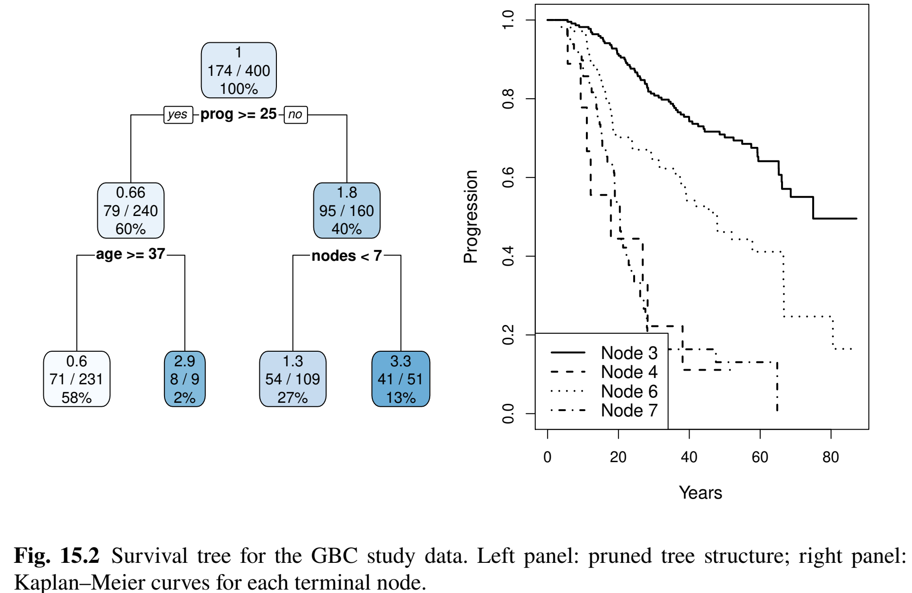

## Outline

::: incremental
1.  Regularized Cox regression models

2.  Survival trees and random forests

4.  Survival surport vector machines

3.  Building prediction models for German Breast Cancer study
:::

$$\newcommand{\d}{{\rm d}}$$ $$\newcommand{\T}{{\rm T}}$$ $$\newcommand{\dd}{{\rm d}}$$ $$\newcommand{\cc}{{\rm c}}$$ $$\newcommand{\pr}{{\rm pr}}$$ $$\newcommand{\var}{{\rm var}}$$ $$\newcommand{\se}{{\rm se}}$$ $$\newcommand{\indep}{\perp \!\!\! \perp}$$ $$\newcommand{\Pn}{n^{-1}\sum_{i=1}^n}$$ $$
\newcommand\mymathop[1]{\mathop{\operatorname{#1}}}
$$ $$
\newcommand{\Ut}{{n \choose 2}^{-1}\sum_{i<j}\sum}
$$

# Regularized Cox Regression

## Rationale

::: fragment
-   **With many covariates**
    -   **Prediction accuracy**: under- vs over-fitting {fig-align="center" width="70%"}
        -   Too many predictors $\to$ overfitting
    -   **Interpretation**: easier with fewer predictors
:::

## Linear Model Basics

::: fragment
-   **Set-up** $$
    Y=\alpha+\beta^\T Z+\epsilon
    $$
    -   $Z$: a $p$-vector of covariates (predictors)
    -   $E(\epsilon\mid Z)=0$
    -   Assume WLOG $\sum_{i=1}^n Y_i=0$ and $\sum_{i=1}^n Z_i=0$
    -   Ordinary least-squares (OLS) estimator \begin{align*}
        \hat\beta_{\rm OLS}=\arg\min_\beta R_n(\beta)=\left(\sum_{i=1}^n Z_i^{\otimes 2}\right)^{-1}\sum_{i=1}^nZ_iY_i
        \end{align*}
        -   $R_n(\beta)=\sum_{i=1}^n(Y_i-\beta^\T Z_i)^2$: residual sum of squares (RSS)
:::

## Subset Selection

::: fragment
-   **Big** $p$ problem
    -   Large variance (overfit) $\to$ poor prediction
    -   $p>n$: no fit
:::

::: fragment
-   **Best-subset selection**
    -   For each $l\in\{0, 1,\ldots, p\}$, choose best model with $l$ covariates with least RSS
    -   $(p+1)$ best models with decreasing RSS (as $l=0,1,\ldots, p$)
    -   Choose $l$ by cross-validation
        -   Partition sample into $k$ pieces
        -   Set one piece aside to evaluate RSS of model fit on remaining data
        -   Cycle through all $k$ pieces and average validation errors
:::

## Cross-Validation

::: fragment
-   **Computing validation error**

{fig-align="center" width="70%"}
:::

## Training vs Prediction Errors

-   Typical relationship between training and validation errors 

<!-- ml_train_valid_err -->
{fig-align="center" width="80%"}


## Subset Selection: Limitations

::: fragment
-   **Best subset**
    -   Fit all $2^p$ submodels
:::

::: fragment
-   **Forward/backward stepwise selections**
    -   Start with null/full model, add/drop most/least significant predictor
    -   Where to stop $\to$ cross-validation
:::

::: fragment
-   **Disadvantages**
    -   **Computationally costly**
    -   **A discrete process**: covariates are either retained or dropped; may be sub-optimal for prediction
:::

## Penalized Regression (I)

::: fragment
-   **Constrained least-squares**
    -   Restricting $L_q$-norm of $\beta$ reduces effective d.f. \begin{equation}\label{eq:vs:constrained}
        \tilde\beta(c)=\arg\min_\beta R_n(\beta), \mbox{ subject to }\sum_{j=1}^p|\beta_j|^q\leq c,
        \end{equation}
:::

::: fragment
-   **Equivalent form by Lagrange multiplier**
    -   $L_q$-penalized regression \begin{equation}\label{eq:vs:penal}
        \hat\beta(\lambda)=\arg\min_\beta \left\{R_n(\beta)+\lambda\sum_{j=1}^p|\beta_j|^q\right\}
        \end{equation}
        -   $\lambda\geq 0$: tuning parameter controlling degree of regulation, determined by cross-validation
        -   $\hat\beta(0)=\hat\beta_{\rm OLS}$; $\hat\beta(\infty)=0$
:::

## Penalized Regression (II)

::: fragment
-   **Examples**
    -   **Ridge regression** $(q=2)$
 \begin{equation}\label{eq:vs:ridge}
            \hat\beta(\lambda)=\left(\sum_{i=1}^n Z_i^{\otimes 2}+\lambda I_p\right)^{-1}\sum_{i=1}^nZ_iY_i
            \end{equation}
    -   **Lasso** ($q=1$; Least absolute shrinkage and selection operator)
        -   Sets some $\hat\beta_j\equiv 0$; sparse solution
    -   **Elastic net**
\begin{equation}\label{eq:vs:en}
            \hat\beta(\lambda)=\arg\min_\beta \left[R_n(\beta)+\lambda\sum_{j=1}^p\left\{\alpha|\beta_j|+2^{-1}(1-\alpha)\beta_j^2\right\}\right]
            \end{equation}
        -   Combines the strengths of ridge regression and lasso 
        -   Handles correlated covariates better than lasso
:::

## Penalized Regression (III)

-  **Geometric intuition**
<!-- ml_lasso_ridge_enet -->

{fig-align="center" width="80%"}

## Regularized Cox Models

::: fragment
-   **Unique features with Cox model**
    -   **Objective function** (RSS not computable due to censoring)
    -   **Computational algorithm**
    -   **Definition of error** for cross-validation
:::

::: fragment
-   **Objective function**: negative log-partial likelihood
\begin{equation}\label{eq:vs:cox_lasso}
Q_n(\beta;\lambda)
 \;=\;
 -\, pl_n(\beta) 
 \,+\,
 \lambda \sum_{j=1}^p 
   \left\{
     \alpha\, |\beta_j|
     \,+\,
     2^{-1} (1-\alpha)\beta_j^2
   \right\}.
\end{equation}
    -   Solution: $\hat\beta(\lambda)=\arg\min_\beta Q_n(\beta;\lambda)$
:::

## Pathwise Solution

::: fragment
-   $\hat\beta(\lambda)$ as a path of $\lambda$
    -   Iterative $pl_n(\beta)\approx$ weighted sum of squares
    -   **Coordinate descent** (Section 15.1.4 of book chapter)
:::

::: fragment
-   $K$-fold cross-validation to select $\lambda_{\rm opt}$
    -   Some $\hat\beta_j(\lambda_{\rm opt})=0$
    -   **Selected variables** $\{Z_{\cdot j}: \hat\beta_j(\lambda_{\rm opt})\neq 0, j=1,\ldots, p\}$
:::

## Cross-Validation Error

::: fragment
-   **What is measure of error?**
    -   RSS not applicable due to censoring
    -   Negative partial-likelihood?
        -   Unstable with small validation set (risk set too small)
:::

::: fragment
-   **Partial-likelihood deviance**
    -   On $j$th validation set $$
          \mbox{CV}_j(\lambda)=pl_{n,-j}\{\hat\beta(\lambda)\}-pl_{n}\{\hat\beta(\lambda)\}
          $$
        -   $pl_{n,-j}(\beta)$: log-partial likelihood based on training set
    -   $\mbox{CV}(\lambda)=k^{-1}\sum_{j=1}^k\mbox{CV}_j(\lambda)$
:::

## Testing Model Performance

- **Workflow**

{fig-align="center" width="75%"}


## Model Evaluation 

- **Test data**
$$
(X_i^*,\, \delta_i^*,\, Z_i^*), \qquad i = 1,\ldots, n^*,
$$
    - $T^*$: true event time
    - $X^* = T^* \wedge C^*$, $\delta^* = I(T^* \le C^*)$

- **Prediction**
    - $\hat g(Z^*)$: predicted risk score (e.g., linear predictor $\hat\beta^\T Z^*$)
    - $\hat S(t\mid Z^*)$: predicted survival function


## Evaluation Metrics - C-Index

- **C-index**: probability of concordance 
$$
\mathcal C
 \;=\;
 \pr\{
   \hat g(Z_i^*) \,>\, \hat g(Z_j^*)
   \mid
   T_i^* < T_j^*
 \}
$$
- **Harrell's C-statistic**
    - Proportion of concordant pairs among comparable pairs
$$
\frac{
  \sum_{i<j}\sum
  \delta_i^* 
  I\{
    \hat g(Z_i^*) > \hat g(Z_j^*),\,
    X_i^* < X_j^*\}
}{
  \sum_{i<j}\sum
  \delta_i^* 
  I( X_i^* < X_j^*)
}
$$

- **Uno's C-statistic**
    - IPCW estimator of probability of concordance by time $\tau$
$$
\mathcal C_\tau
 \;=\;
 \pr\{
   \hat g(Z_i^*) > \hat g(Z_j^*)
   \mid
   T_i^* < T_j^* \wedge \tau
\}
$$

## Evaluation Metrics - AUC & Brier Score

- **AUC**: area under the time-dependent ROC curve
    - IPCW estimator of probability of concordance at time $t$
$$
    \text{AUC}(t)
 \;=\;
 \pr\{
   \hat g(Z_i^*) > \hat g(Z_j^*)
   \mid
   T_i^* \le t,\;
   T_j^* > t\}
$$

- **Brier score**
    - IPCW estimator mean squared error for predicted vs observed 
$$
\text{BS}(t)
 \;=\;
 E\left[
   \left\{
     I(T_i^* > t) - \hat S(t \mid Z_i^*)
   \right\}^2
 \right].
$$

## Evaluation Metrics - Summary

- **Summary of evaluation metrics**

```{r}
#| eval: true
#| echo: false

library(knitr)

data.frame(
  Metric = c("Harrell's C",
             "Uno's C_tau",
             "Time-dependent AUC(t)",
             "Integrated AUC",
             "Brier score BS(t)",
             "Integrated Brier score"),
  Range = c("[0, 1]",
            "[0, 1]",
            "[0, 1]",
            "[0, ∞)",
            "[0, ∞)",
            "[0, ∞)"),
  Focus = c("Discrimination",
            "Discrimination",
            "Discrimination",
            "Discrimination",
            "Discrimination/Calibration",
            "Discrimination/Calibration"),
  `Time-Dimension` = c("Overall",
                       "Overall",
                       "Dynamic",
                       "Overall",
                       "Dynamic",
                       "Overall"),
  `Affected by Censoring` = c("Yes",
                             "No",
                             "No",
                             "No",
                             "No",
                             "No")
) |>
kable(
  align = c("l", "c", "c", "c", "c")
)
```


## Software: `glmnet::glmnet()` (I)

:::: fragment
-   **Basic syntax for regularized Cox model**
    -   **Elastic net** $$
        \hat\beta(\lambda)=\arg\min_\beta \left[-n^{-1}pl_n(\beta)+\lambda\sum_{j=1}^p\left\{\alpha|\beta_j|+2^{-1}(1-\alpha)\beta_j^2\right\}\right]
        $$
    -   `Z`: covariate matrix; `alpha`: $\alpha$

::: big-code
```{r}
#| eval: false
#| echo: true
# compute the covariate path as a function of lambda
# alpha=1: L_1 penalty (lasso)
obj <- glmnet(Z, Surv(time, status), family = "cox", alpha = 1)
# compute 10-fold (default) cross-validation
obj.cv <- cv.glmnet(Z, Surv(time, status), family = "cox", 
                    alpha = 1)

```
:::
::::

## Software: `glmnet::glmnet()` (II)

:::: fragment
-   **Find optimal** $\lambda$

::: big-code
```{r}
#| eval: false
#| echo: true
# plot validation error (partial-likelihood deviance)
# as a function of log-lambda
plot(obj.cv)
# the optimal lambda
obj.cv$lambda.min
# the beta at optimal lambda
beta <- coef(obj.cv, s = "lambda.min")
```
:::

-  Prediction on test data
    - `beta`: $\hat g(z^*)=\hat\beta^\T z^*$
    - Refit Cox model using selected predictors to get $\hat S(t\mid z^*)$

::::

## GBC: An Example

::: fragment
-   **German Breast Cancer (GBC) study**
    -   **Cohort**: 686 breast cancer patients\
    -   **Outcome**: relapse-free survival
    -   **Predictors**: age ($\leq$ 40 vs \>40), menopausal status, hormone treatment, tumor grade, tumor size, lymph nodes, estrogen and progesterone receptor levels
    -   Training set ($n=400$) + test set ($n=286$)

```{r}
#| eval: false
#| echo: true
# select training set N=400
set.seed(1234)
ind   <- sample(1:n, size = 400)
train <- df[ind, ]
test  <- df[-ind, ]
```
:::

## Graphics

- **Pathwise solution and CV curve**

{fig-align="center" width="90%"}


## Selected Predictors

::: fragment
-   **CV results**

    -   $\log(\lambda_{\rm opt}) = -3.7$

```{r}
#| eval: false
#| echo: true
# Identify the optimal lambda 
lambda.opt <- obj.cv$lambda.min
lambda.opt
# [1] 0.02472102

# Extract coefficients at lambda.min
beta.opt   <- coef(obj.cv, s = "lambda.min")
# Identify which coefficients are non-zero
beta.selected  <- beta.opt[abs(beta.opt[, 1]) > 0, ]
beta.selected  # show non-zero variables
#>      hormone        age40         size        grade        nodes         prog 
#> -0.354175646  0.428284913  0.003006433  0.197080456  0.039587219 -0.002741544 
```
:::

# Survival Trees & Random Forests

## Decision Trees

::: fragment
-   **Limitations of regularized Cox model**
    -   Proportionality
    -   Linearity of covariate effects
    -   Interactions
:::

::: fragment
-   **Tree-based classification and regression**
    -   *Classification and Regression Trees* (CART; Breiman et al., 1984)
    -   Root node (all sample) $\stackrel{\rm covariates}{\rightarrow}$ split into (more homogeneous) daughter nodes $\stackrel{\rm covariates}{\rightarrow}$ split recursively
:::

## Basic Procedures

::: fragment
-   **Growing the tree**
    -   Starting with root node, search splitting criteria $$Z_{\cdot j}\leq z \,\,\,(j=1,\ldots, p; z \in\mathbb R)$$ for one that minimizes "impurity" within daughter nodes \begin{equation}\label{eq:tree:nodes}
        A=\{i=1,\ldots, n: Z_{ij}\leq z\} \mbox{ and } 
        B=\{i=1,\ldots, n: Z_{ij}> z\}
        \end{equation}
    -   Recursive splitting until terminal nodes sufficiently "pure" in outcome
:::

::: fragment
-   **Tree-based prediction**
    -   A new covariate vector $\to$ terminal node it belongs $\to$ predicted outcome
        -   Majority class
        -   empirical mean
        -   Kaplan-Meier estimator
:::


## An Example

-   **An illustrative decision tree**

<!-- ml_toy_tree -->
{fig-align="center" width="80%"}

## Splitting Criterion

::: fragment
-   **Objective function**
    -   Choose partition $A|B$ to minimize $$
        R(A\mid\mid B)=\hat P(A)\hat{\mathcal G}(A)+\hat P(B)\hat{\mathcal G}(B)
        $$
        -   $\hat P(A)$, $\hat P(B)$: proportions of observations in daughter nodes
        -   $\hat{\mathcal G}(A)$, $\hat{\mathcal G}(B)$: impurity measures within daughter nodes
:::

::: fragment
-   **Impurity measure**
    -   **Categorical** $Y \in\{1,\ldots, K\}$: Gini index $\pr(Y_i\neq Y_j)$
    -   **Continuous**: mean squared error
    -   **Survival**: mean squared deviance residuals (Cox model with binary node) \begin{equation}\label{eq:tree:deviance}
        R(A\mid\mid B)=n^{-1}\sum_{i \in A}d_{i}^2 +n^{-1}\sum_{i \in B}d_{i}^2
        \end{equation}
:::

## Pruning the Tree

::: fragment
-   **Penalize complexity**
    -   Cut overgrown branches $\to$ prevent overfitting $\to$ generalizability\
    -   Minimize $R(\mathcal T;\lambda)=R(\mathcal T)+\lambda|\mathcal T|$
        -   $R(\mathcal T)$: mean squared (deviance) residuals for terminal nodes of tree $\mathcal T$
        -   $|\mathcal T|$: number of terminal nodes
        -   $\lambda\geq 0$: cost-complexity parameter determined by cross-validation
:::

::: fragment
-   **Final tree**
    -   $\mathcal T^{\rm opt} = \arg\min_{\mathcal T}R(\mathcal T;\lambda_{\rm opt})$
    -   $\mathcal T^{\rm opt}(z)$: terminal node for new covariate vector $z$
    -   $\hat S(t\mid z^*)$: KM estimates in node $\mathcal T^{\rm opt}(z^*)$
:::


## Bagging and Random Forests

::: fragment
-   **Bagging**
    -   A single tree $\to$ large variance
    -   Take $B$ bootstrapped samples from training data
        -   $\mathcal T_b$: survival tree grown on $b$th bootstrap sample $(b=1, \ldots, B)$ (without pruning)
        -   $\hat S_b(t\mid z)$: predicted survival function\
    -   **Final prediction** $$
         \hat S(t\mid z)=B^{-1}\sum_{b=1}^B \hat S_b(t\mid z)
         $$

-   **Random forests**
    -   Same except only a random subset of covariates are considered at each split
    -   De-correlate the trees grown on different bootstrapped samples)
:::

## Oblique vs Axis-Aligned Splits

-  **Split on linear combination of covariates** (oblique) 
<!-- ml_orsf_boundary -->
{fig-align="center" width="80%"}


## Out-of-Bag (OOB) Samples

-  **OOB samples**
    -   $(1-n^{-1})^n\approx 36.8\%$ not included in bootstrap sample for each tree $\mathcal T_b$
    -   Used to compute predictor error 
    -   Monitor performance as forest grows


## Software: `rpart::rpart()`

:::: fragment
-   **Basic syntax for growing survival tree**
    -   `xval`: number of cross-validation folds
    -   `minbucket`: minimum number of observations in terminal nodes
    -   `cp`: complexity parameter (set to 0 for full tree)
    
::: big-code
```{r}
#| eval: false
#| echo: true
# grow the tree, with cross-validation
obj <- rpart(Surv(time, status) ~ covariates, 
    control = rpart.control(xval = 10, minbucket = 2, cp = 0))
# cross-validation results
cptable <- obj$cptable
# complexity parameter (lambda)
CP <- cptable[, 1] 
# find optimal parameter
# cptable[, 4]: error function
cp.opt <- CP[which.min(cptable[, 4])] 
```
:::
::::

## Software: `rpart::prune()`

:::: fragment
-   **Basic syntax for pruning survival tree**
    -   `tree`: `rpart` object for grown tree; `cp`: optimal $\lambda$
    -   `test`: test data frame

::: big-code
```{r}
#| eval: false
#| echo: true
# prune the tree, with optimal lambda
fit <- prune(tree = obj, cp = cp.opt)
# plot the pruned tree structure
rpart.plot(fit)
# fit$where: vector of terminal node for training data
# compute KM estimates by terminal node
km <- survfit(Surv(time, status) ~ fit$where)
## prediction on test data ---------------------------
# terminal node for test data
treeClust::rpart.predict.leaves(fit, test) 
```
:::
::::


## Software: `aorsf:orsf()`

- **Oblique random survival forests**

::: big-code
```{r}
#| eval: false
#| echo: true
# grow the tree, with cross-validation
obj <- rpart(Surv(time, status) ~ covariates, 
    control = rpart.control(xval = 10, minbucket = 2, cp = 0))
# cross-validation results
cptable <- obj$cptable
# complexity parameter (lambda)
CP <- cptable[, 1] 
# find optimal parameter
# cptable[, 4]: error function
cp.opt <- CP[which.min(cptable[, 4])] 
```
:::

## GBC: Survival Trees

::: fragment
-   **Same training data**
    -   $\lambda_{\rm opt}=0.017$; 3 splits (4 terminal nodes)

```{r}
#| eval: false
#| echo: true
# Conduct 10-fold cross-validation (xval = 10)
obj <- rpart(Surv(time, status) ~ hormone + meno + size + grade + nodes + 
              prog + estrg + age,
             control = rpart.control(xval = 10, minbucket = 2, cp = 0),
             data = train)
printcp(obj) # xerror: objective 
#            CP  nsplit rel.error  xerror   xstd
# 1  0.07556835      0   1.00000 1.00411 0.046231
# 2  0.03720019      1   0.92443 0.96817 0.047281
# 3  0.02661914      2   0.88723 0.95124 0.046567
# 4  0.01716925      3   0.86061 0.92745 0.046606 # minimizer
# 5  0.01398306      4   0.84344 0.92976 0.047514
# 6  0.01394869      5   0.82946 0.93941 0.048404
# 7  0.01055028      9   0.77120 0.97722 0.052133

```
:::

## GBC: Final Tree

::: fragment
-   **Pruned tree**

{fig-align="center" width="65%"}
:::

## GBC: Brier Scores

::: fragment
-   **Brier scores of three models on test data**

{fig-align="center" width="60%"}
:::

# Conclusion

## Notes (I)

-   **The lasso**
    -   First proposed by Tibshirani (1996) for least-squares
    -   Extended to Cox model by Tibshirani (1997)
    -   Algorithms for $L_1$-regularized Cox model described in Simon et al. (2011)
-   **Variations**
    -   group lasso (Yuan and Lin, 2006)
    -   adaptive lasso (Zou, 2006)
    -   smoothly clipped absolute deviations (SCAD; Xie and Huang, 2009)
-   **Elastic net for win ratio**
    -   [WRnet](https://doi.org/10.1186/s12874-025-02554-w) (Mao, 2025)

## Notes (II)

:::::: columns
:::: {.column width="60%"}
::: {style="font-size: 98%"}
-   **More on decision trees**
    -   **Text**: Breiman et al. (1984)
    -   **Review article**: Bou-Hamad et al. (2011, *Statistics Surveys*)
-   **Bagging and random forests** (R-packages)
    -   `ipred`
    -   `randomSurvivalForest`
    -   `ranger`
:::
::::

::: {.column width="40%"}
{fig-align="center" width="80%"}
:::
::::::

## Notes (III)

-   **Tidymodels**
    -   `censored`: a member of `tidymodels` family
    -   <https://censored.tidymodels.org/>

::: big-code
```{r}
#| eval: false
#| echo: true
library(censored) 

decision_tree() %>% 
  set_engine("rpart") %>% 
  set_mode("censored regression")
#> Decision Tree Model Specification (censored regression)
#> 
#> Computational engine: rpart
```
:::

## Summary

-   **Regularized Cox model**
    -   **Objective function** $$
        Q_n(\beta;\lambda)=-n^{-1}pl_n(\beta)+\lambda\sum_{j=1}^p|\beta_j|
        $$
        -   `glmnet::glmnet(Z, Surv(time, status), family =  “cox”, alpha = 1)`
-   **Survival trees**
    -   Root node $\to$ recursive partitioning based on similarity in outcome $\to$ pruning to prevent overfitting
        -   `rpart:: rpart(Surv(time, status) ~ covariates)`
