## Outline

::: incremental
1.  Regularized Cox regression models

2.  Survival trees and random forests

4.  Survival surport vector machines

5.  R's Tidymodels system
:::

$$\newcommand{\d}{{\rm d}}$$ $$\newcommand{\T}{{\rm T}}$$ $$\newcommand{\dd}{{\rm d}}$$ $$\newcommand{\cc}{{\rm c}}$$ $$\newcommand{\pr}{{\rm pr}}$$ $$\newcommand{\var}{{\rm var}}$$ $$\newcommand{\se}{{\rm se}}$$ $$\newcommand{\indep}{\perp \!\!\! \perp}$$ $$\newcommand{\Pn}{n^{-1}\sum_{i=1}^n}$$ $$
\newcommand\mymathop[1]{\mathop{\operatorname{#1}}}
$$ $$
\newcommand{\Ut}{{n \choose 2}^{-1}\sum_{i<j}\sum}
$$

# Regularized Cox Regression

## Rationale

::: fragment
-   **With many covariates**
    -   **Prediction accuracy**: under- vs over-fitting 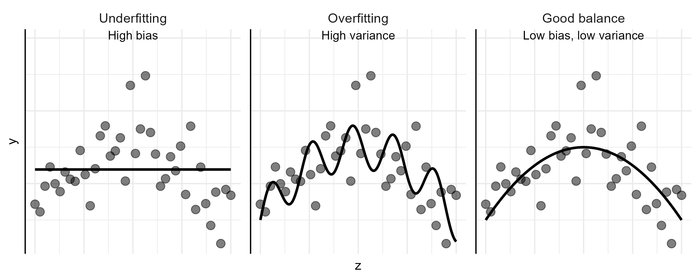{fig-align="center" width="70%"}
        -   Too many predictors $\to$ overfitting
    -   **Interpretation**: easier with fewer predictors
:::

## Linear Model Basics

::: fragment
-   **Set-up** $$
    Y=\alpha+\beta^\T Z+\epsilon
    $$
    -   $Z$: a $p$-vector of covariates (predictors)
    -   $E(\epsilon\mid Z)=0$
    -   Assume WLOG $\sum_{i=1}^n Y_i=0$ and $\sum_{i=1}^n Z_i=0$
    -   Ordinary least-squares (OLS) estimator \begin{align*}
        \hat\beta_{\rm OLS}=\arg\min_\beta R_n(\beta)=\left(\sum_{i=1}^n Z_i^{\otimes 2}\right)^{-1}\sum_{i=1}^nZ_iY_i
        \end{align*}
        -   $R_n(\beta)=\sum_{i=1}^n(Y_i-\beta^\T Z_i)^2$: residual sum of squares (RSS)
:::

## Subset Selection

::: fragment
-   **Big** $p$ problem
    -   Large variance (overfit) $\to$ poor prediction
    -   $p>n$: no fit
:::

::: fragment
-   **Best-subset selection**
    -   For each $l\in\{0, 1,\ldots, p\}$, choose best model with $l$ covariates with least RSS
    -   $(p+1)$ best models with decreasing RSS (as $l=0,1,\ldots, p$)
    -   Choose $l$ by cross-validation
        -   Partition sample into $k$ pieces
        -   Set one piece aside to evaluate RSS of model fit on remaining data
        -   Cycle through all $k$ pieces and average validation errors
:::

## Cross-Validation

::: fragment
-   **Computing validation error**

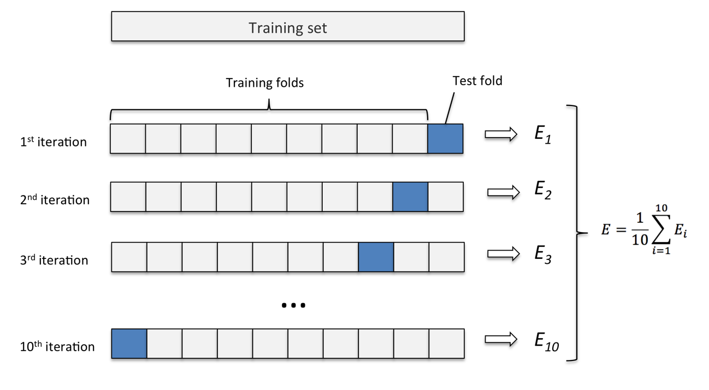{fig-align="center" width="70%"}
:::

## Training vs Prediction Errors

-   Typical relationship between training and validation errors 

<!-- ml_train_valid_err -->
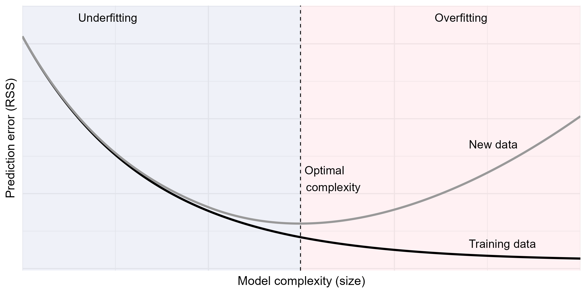{fig-align="center" width="80%"}


## Subset Selection: Limitations

::: fragment
-   **Best subset**
    -   Fit all $2^p$ submodels
:::

::: fragment
-   **Forward/backward stepwise selections**
    -   Start with null/full model, add/drop most/least significant predictor
    -   Where to stop $\to$ cross-validation
:::

::: fragment
-   **Disadvantages**
    -   **Computationally costly**
    -   **A discrete process**: covariates are either retained or dropped; may be sub-optimal for prediction
:::

## Penalized Regression (I)

::: fragment
-   **Constrained least-squares**
    -   Restricting $L_q$-norm of $\beta$ reduces effective d.f. \begin{equation}\label{eq:vs:constrained}
        \tilde\beta(c)=\arg\min_\beta R_n(\beta), \mbox{ subject to }\sum_{j=1}^p|\beta_j|^q\leq c,
        \end{equation}
:::

::: fragment
-   **Equivalent form by Lagrange multiplier**
    -   $L_q$-penalized regression \begin{equation}\label{eq:vs:penal}
        \hat\beta(\lambda)=\arg\min_\beta \left\{R_n(\beta)+\lambda\sum_{j=1}^p|\beta_j|^q\right\}
        \end{equation}
        -   $\lambda\geq 0$: tuning parameter controlling degree of regulation, determined by cross-validation
        -   $\hat\beta(0)=\hat\beta_{\rm OLS}$; $\hat\beta(\infty)=0$
:::

## Penalized Regression (II)

::: fragment
-   **Examples**
    -   **Ridge regression** $(q=2)$
 \begin{equation}\label{eq:vs:ridge}
            \hat\beta(\lambda)=\left(\sum_{i=1}^n Z_i^{\otimes 2}+\lambda I_p\right)^{-1}\sum_{i=1}^nZ_iY_i
            \end{equation}
    -   **Lasso** ($q=1$; Least absolute shrinkage and selection operator)
        -   Sets some $\hat\beta_j\equiv 0$; sparse solution
    -   **Elastic net**
\begin{equation}\label{eq:vs:en}
            \hat\beta(\lambda)=\arg\min_\beta \left[R_n(\beta)+\lambda\sum_{j=1}^p\left\{\alpha|\beta_j|+2^{-1}(1-\alpha)\beta_j^2\right\}\right]
            \end{equation}
        -   Combines the strengths of ridge regression and lasso 
        -   Handles correlated covariates better than lasso
:::

## Penalized Regression (III)

-  **Geometric intuition**
<!-- ml_lasso_ridge_enet -->

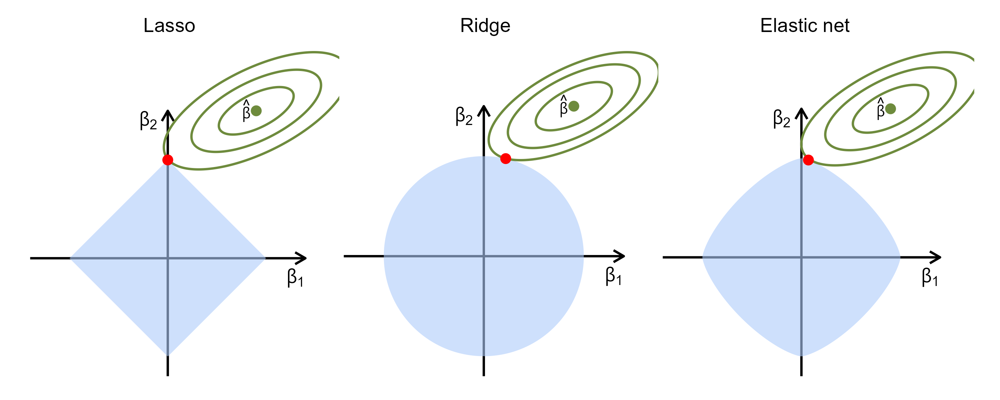{fig-align="center" width="80%"}

## Regularized Cox Models

::: fragment
-   **Unique features with Cox model**
    -   **Objective function** (RSS not computable due to censoring)
    -   **Computational algorithm**
    -   **Definition of error** for cross-validation
:::

::: fragment
-   **Objective function**: negative log-partial likelihood
\begin{equation}\label{eq:vs:cox_lasso}
Q_n(\beta;\lambda)
 \;=\;
 -\, pl_n(\beta) 
 \,+\,
 \lambda \sum_{j=1}^p 
   \left\{
     \alpha\, |\beta_j|
     \,+\,
     2^{-1} (1-\alpha)\beta_j^2
   \right\}.
\end{equation}
    -   Solution: $\hat\beta(\lambda)=\arg\min_\beta Q_n(\beta;\lambda)$
:::

## Pathwise Solution

::: fragment
-   $\hat\beta(\lambda)$ as a path of $\lambda$
    -   Iterative $pl_n(\beta)\approx$ weighted sum of squares
    -   **Coordinate descent** (Section 15.1.4 of book chapter)
:::

::: fragment
-   $K$-fold cross-validation to select $\lambda_{\rm opt}$
    -   Some $\hat\beta_j(\lambda_{\rm opt})=0$
    -   **Selected variables** $\{Z_{\cdot j}: \hat\beta_j(\lambda_{\rm opt})\neq 0, j=1,\ldots, p\}$
:::

## Cross-Validation Error

::: fragment
-   **What is measure of error?**
    -   RSS not applicable due to censoring
    -   Negative partial-likelihood?
        -   Unstable with small validation set (risk set too small)
:::

::: fragment
-   **Partial-likelihood deviance**
    -   On $j$th validation set $$
          \mbox{CV}_j(\lambda)=pl_{n,-j}\{\hat\beta(\lambda)\}-pl_{n}\{\hat\beta(\lambda)\}
          $$
        -   $pl_{n,-j}(\beta)$: log-partial likelihood based on training set
    -   $\mbox{CV}(\lambda)=k^{-1}\sum_{j=1}^k\mbox{CV}_j(\lambda)$
:::

## Testing Model Performance

- **Workflow**

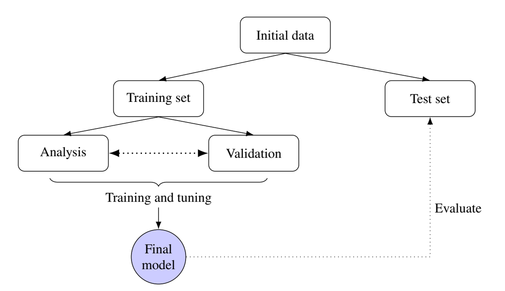{fig-align="center" width="75%"}


## Model Evaluation 

- **Test data**
$$
(X_i^*,\, \delta_i^*,\, Z_i^*), \qquad i = 1,\ldots, n^*,
$$
    - $T^*$: true event time
    - $X^* = T^* \wedge C^*$, $\delta^* = I(T^* \le C^*)$

- **Prediction**
    - $\hat g(Z^*)$: predicted risk score (e.g., linear predictor $\hat\beta^\T Z^*$)
    - $\hat S(t\mid Z^*)$: predicted survival function


## Evaluation Metrics - C-Index

- **C-index**: probability of concordance 
$$
\mathcal C
 \;=\;
 \pr\{
   \hat g(Z_i^*) \,>\, \hat g(Z_j^*)
   \mid
   T_i^* < T_j^*
 \}
$$
- **Harrell's C-statistic**
    - Proportion of concordant pairs among comparable pairs
$$
\frac{
  \sum_{i<j}\sum
  \delta_i^* 
  I\{
    \hat g(Z_i^*) > \hat g(Z_j^*),\,
    X_i^* < X_j^*\}
}{
  \sum_{i<j}\sum
  \delta_i^* 
  I( X_i^* < X_j^*)
}
$$

- **Uno's C-statistic**
    - IPCW estimator of probability of concordance by time $\tau$
$$
\mathcal C_\tau
 \;=\;
 \pr\{
   \hat g(Z_i^*) > \hat g(Z_j^*)
   \mid
   T_i^* < T_j^* \wedge \tau
\}
$$

## Evaluation Metrics - AUC & Brier Score

- **AUC**: area under the time-dependent ROC curve
    - IPCW estimator of probability of concordance at time $t$
$$
    \text{AUC}(t)
 \;=\;
 \pr\{
   \hat g(Z_i^*) > \hat g(Z_j^*)
   \mid
   T_i^* \le t,\;
   T_j^* > t\}
$$

- **Brier score**
    - IPCW estimator mean squared error for predicted vs observed 
$$
\text{BS}(t)
 \;=\;
 E\left[
   \left\{
     I(T_i^* > t) - \hat S(t \mid Z_i^*)
   \right\}^2
 \right].
$$

## Evaluation Metrics - Summary

- **Summary of evaluation metrics**

```{r}
#| eval: true
#| echo: false

library(knitr)

data.frame(
  Metric = c("Harrell's C",
             "Uno's C_tau",
             "Time-dependent AUC(t)",
             "Integrated AUC",
             "Brier score BS(t)",
             "Integrated Brier score"),
  Range = c("[0, 1]",
            "[0, 1]",
            "[0, 1]",
            "[0, ∞)",
            "[0, ∞)",
            "[0, ∞)"),
  Focus = c("Discrimination",
            "Discrimination",
            "Discrimination",
            "Discrimination",
            "Discrimination/Calibration",
            "Discrimination/Calibration"),
  `Time-Dimension` = c("Overall",
                       "Overall",
                       "Dynamic",
                       "Overall",
                       "Dynamic",
                       "Overall"),
  `Affected by Censoring` = c("Yes",
                             "No",
                             "No",
                             "No",
                             "No",
                             "No")
) |>
kable(
  align = c("l", "c", "c", "c", "c")
)
```


## Software: `glmnet::glmnet()` (I)

:::: fragment
-   **Basic syntax for regularized Cox model**
    -   **Elastic net** $$
        \hat\beta(\lambda)=\arg\min_\beta \left[-n^{-1}pl_n(\beta)+\lambda\sum_{j=1}^p\left\{\alpha|\beta_j|+2^{-1}(1-\alpha)\beta_j^2\right\}\right]
        $$
    -   `Z`: covariate matrix; `alpha`: $\alpha$

::: big-code
```{r}
#| eval: false
#| echo: true
# compute the covariate path as a function of lambda
# alpha=1: L_1 penalty (lasso)
obj <- glmnet(Z, Surv(time, status), family = "cox", alpha = 1)
# compute 10-fold (default) cross-validation
obj.cv <- cv.glmnet(Z, Surv(time, status), family = "cox", 
                    alpha = 1)

```
:::
::::

## Software: `glmnet::glmnet()` (II)

:::: fragment
-   **Find optimal** $\lambda$

::: big-code
```{r}
#| eval: false
#| echo: true
# plot validation error (partial-likelihood deviance)
# as a function of log-lambda
plot(obj.cv)
# the optimal lambda
obj.cv$lambda.min
# the beta at optimal lambda
beta <- coef(obj.cv, s = "lambda.min")
```
:::

-  Prediction on test data
    - `beta`: $\hat g(z^*)=\hat\beta^\T z^*$
    - Refit Cox model using selected predictors to get $\hat S(t\mid z^*)$

::::

## GBC: An Example

::: fragment
-   **German Breast Cancer (GBC) study**
    -   **Cohort**: 686 breast cancer patients\
    -   **Outcome**: relapse-free survival
    -   **Predictors**: age ($\leq$ 40 vs \>40), menopausal status, hormone treatment, tumor grade, tumor size, lymph nodes, estrogen and progesterone receptor levels
    -   Training set ($n=400$) + test set ($n^*=286$)

```{r}
#| eval: false
#| echo: true
# select training set N=400
set.seed(1234)
ind   <- sample(1:n, size = 400)
train <- df[ind, ]
test  <- df[-ind, ]
```
:::

## Graphics

- **Pathwise solution and CV curve**

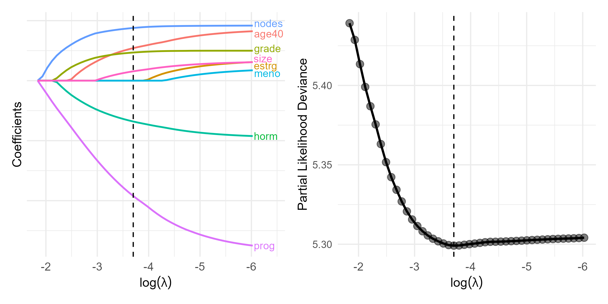{fig-align="center" width="90%"}


## Selected Predictors

::: fragment
-   **CV results**

    -   $\log(\lambda_{\rm opt}) = -3.7$

```{r}
#| eval: false
#| echo: true
# Identify the optimal lambda 
lambda.opt <- obj.cv$lambda.min
lambda.opt
# [1] 0.02472102

# Extract coefficients at lambda.min
beta.opt   <- coef(obj.cv, s = "lambda.min")
# Identify which coefficients are non-zero
beta.selected  <- beta.opt[abs(beta.opt[, 1]) > 0, ]
beta.selected  # show non-zero variables
#>      hormone        age40         size        grade        nodes         prog 
#> -0.354175646  0.428284913  0.003006433  0.197080456  0.039587219 -0.002741544 
```
:::

# Survival Trees & Random Forests

## Decision Trees

::: fragment
-   **Limitations of regularized Cox model**
    -   Proportionality
    -   Linearity of covariate effects
    -   Interactions
:::

::: fragment
-   **Tree-based classification and regression**
    -   *Classification and Regression Trees* (CART; Breiman et al., 1984)
    -   Root node (all sample) $\stackrel{\rm covariates}{\rightarrow}$ split into (more homogeneous) daughter nodes $\stackrel{\rm covariates}{\rightarrow}$ split recursively
:::

## Basic Procedures

::: fragment
-   **Growing the tree**
    -   Starting with root node, search splitting criteria $$Z_{\cdot j}\leq z \,\,\,(j=1,\ldots, p; z \in\mathbb R)$$ for one that minimizes "impurity" within daughter nodes \begin{equation}\label{eq:tree:nodes}
        A=\{i=1,\ldots, n: Z_{ij}\leq z\} \mbox{ and } 
        B=\{i=1,\ldots, n: Z_{ij}> z\}
        \end{equation}
    -   Recursive splitting until terminal nodes sufficiently "pure" in outcome
:::

::: fragment
-   **Tree-based prediction**
    -   A new covariate vector $\to$ terminal node it belongs $\to$ predicted outcome
        -   Majority class
        -   empirical mean
        -   Kaplan-Meier estimator
:::


## An Example

-   **An illustrative decision tree**

<!-- ml_toy_tree -->
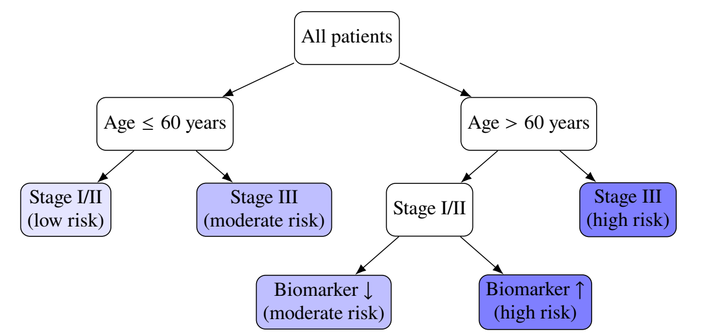{fig-align="center" width="80%"}

## Splitting Criterion

::: fragment
-   **Objective function**
    -   Choose partition $A|B$ to minimize $$
        R(A\mid\mid B)=\hat P(A)\hat{\mathcal G}(A)+\hat P(B)\hat{\mathcal G}(B)
        $$
        -   $\hat P(A)$, $\hat P(B)$: proportions of observations in daughter nodes
        -   $\hat{\mathcal G}(A)$, $\hat{\mathcal G}(B)$: impurity measures within daughter nodes
:::

::: fragment
-   **Impurity measure**
    -   **Categorical** $Y \in\{1,\ldots, K\}$: Gini index $\pr(Y_i\neq Y_j)$
    -   **Continuous**: mean squared error
    -   **Survival**: mean squared deviance residuals (Cox model with binary node) \begin{equation}\label{eq:tree:deviance}
        R(A\mid\mid B)=n^{-1}\sum_{i \in A}d_{i}^2 +n^{-1}\sum_{i \in B}d_{i}^2
        \end{equation}
:::

## Pruning the Tree

::: fragment
-   **Penalize complexity**
    -   Cut overgrown branches $\to$ prevent overfitting $\to$ generalizability\
    -   Minimize $R(\mathcal T;\lambda)=R(\mathcal T)+\lambda|\mathcal T|$
        -   $R(\mathcal T)$: mean squared (deviance) residuals for terminal nodes of tree $\mathcal T$
        -   $|\mathcal T|$: number of terminal nodes
        -   $\lambda\geq 0$: cost-complexity parameter determined by cross-validation
:::

::: fragment
-   **Final tree**
    -   $\mathcal T^{\rm opt} = \arg\min_{\mathcal T}R(\mathcal T;\lambda_{\rm opt})$
    -   $\mathcal T^{\rm opt}(z)$: terminal node for new covariate vector $z$
    -   $\hat S(t\mid z^*)$: KM estimates in node $\mathcal T^{\rm opt}(z^*)$
:::


## Bagging and Random Forests

::: fragment
-   **Bagging**
    -   A single tree $\to$ large variance
    -   Take $B$ bootstrapped samples from training data
        -   $\mathcal T_b$: survival tree grown on $b$th bootstrap sample $(b=1, \ldots, B)$ (without pruning)
        -   $\hat S_b(t\mid z)$: predicted survival function\
    -   **Final prediction** $$
         \hat S(t\mid z)=B^{-1}\sum_{b=1}^B \hat S_b(t\mid z)
         $$

-   **Random forests**
    -   Same except only a random subset of covariates are considered at each split
    -   De-correlate the trees grown on different bootstrapped samples)
:::

## Oblique vs Axis-Aligned Splits

-  **Split on linear combination of covariates** (oblique) 
<!-- ml_orsf_boundary -->
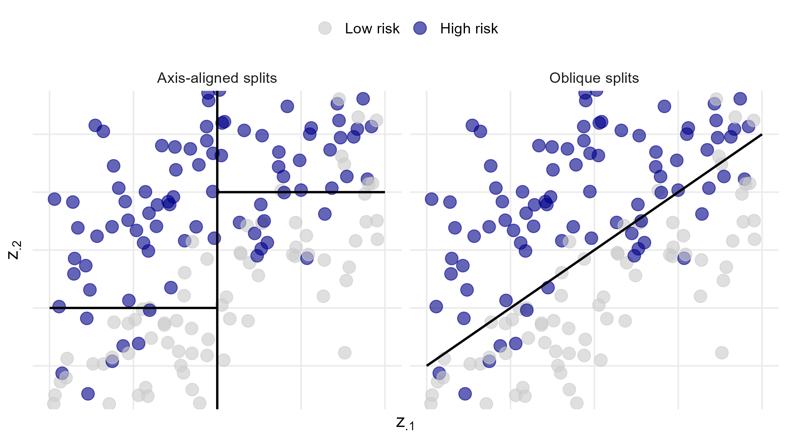{fig-align="center" width="80%"}


## Out-of-Bag (OOB) Samples

-  **OOB samples**
    -   $(1-n^{-1})^n\approx 36.8\%$ not included in bootstrap sample for each tree $\mathcal T_b$
    -   Used to compute predictor error 
    -   Monitor performance as forest grows


## Software: `rpart::rpart()`

:::: fragment
-   **Basic syntax for growing survival tree**
    -   `xval`: number of cross-validation folds
    -   `minbucket`: minimum number of observations in terminal nodes
    -   `cp`: complexity parameter (set to 0 for full tree)
    
::: big-code
```{r}
#| eval: false
#| echo: true
# grow the tree, with cross-validation
obj <- rpart(Surv(time, status) ~ covariates, 
    control = rpart.control(xval = 10, minbucket = 2, cp = 0))
# cross-validation results
cptable <- obj$cptable
# complexity parameter (lambda)
CP <- cptable[, 1] 
# find optimal parameter
# cptable[, 4]: error function
cp.opt <- CP[which.min(cptable[, 4])] 
```
:::
::::

## Software: `rpart::prune()`

:::: fragment
-   **Basic syntax for pruning survival tree**
    -   `tree`: `rpart` object for grown tree; `cp`: optimal $\lambda$
    -   `test`: test data frame

::: big-code
```{r}
#| eval: false
#| echo: true
# prune the tree, with optimal lambda
fit <- prune(tree = obj, cp = cp.opt)
# plot the pruned tree structure
rpart.plot(fit)
# fit$where: vector of terminal node for training data
# compute KM estimates by terminal node
km <- survfit(Surv(time, status) ~ fit$where)

## prediction on test data ---------------------------
# terminal node for test data
treeClust::rpart.predict.leaves(fit, test) 
```
:::
::::


## Software: `aorsf:orsf()` (I)

- **Oblique random survival forests**
    - `mtry`: number of covariates randomly selected at each split
    
::: big-code
```{r}
#| eval: false
#| echo: true
library(aorsf)
# Fit a basic oblique random survival forest on training data
set.seed(12345) # for reproducibility
fit <- orsf(
  Surv(<time>, <status>) ~ covariates, 
  # Optional arguments:
      # Forest size
        n_tree = 500,
      # Number of covariates randomly selected at each split
        mtry = ceiling(sqrt(p)),
         ...
)
```
:::

## Software: `aorsf:orsf()` (II)

-  **Variable importance**
    - Based on degradation of OOB prediction accuracy after permuting $Z_{\cdot j}$

```{r}
#| eval: false
#| echo: true
orsf_vi_permute(fit) # permutation-based variable importance
```

- **Prediction **

```{r}
#| eval: false
#| echo: true
# Survival prediction on test set
pred_orsf <- predict(
  fit,                       # fitted orsf object
  new_data = test,           # test dataset
  pred_type = "surv",        # survival function
  pred_horizon = 0:60        # evaluation times
)
```


## GBC: Fitting Survival Trees

::: fragment
-   **Same training data**
    -   $\lambda_{\rm opt}=0.017$; 3 splits (4 terminal nodes)

```{r}
#| eval: false
#| echo: true
# Conduct 10-fold cross-validation (xval = 10)
obj <- rpart(Surv(time, status) ~ hormone + meno + size + grade + nodes + 
              prog + estrg + age,
             control = rpart.control(xval = 10, minbucket = 2, cp = 0),
             data = train)
printcp(obj) # xerror: objective 
#            CP  nsplit rel.error  xerror   xstd
# 1  0.07556835      0   1.00000 1.00411 0.046231
# 2  0.03720019      1   0.92443 0.96817 0.047281
# 3  0.02661914      2   0.88723 0.95124 0.046567
# 4  0.01716925      3   0.86061 0.92745 0.046606 # minimizer
# 5  0.01398306      4   0.84344 0.92976 0.047514
# 6  0.01394869      5   0.82946 0.93941 0.048404
# 7  0.01055028      9   0.77120 0.97722 0.052133

```
:::

## GBC: Survival Tree CV Result

- **CV results and final tree**
    -   $\log(\lambda_{\rm opt}) = -4.1$

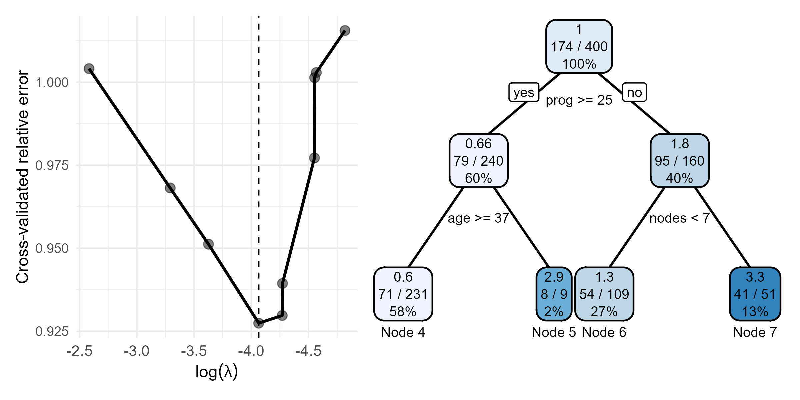{fig-align="center" width="80%"}

## GBC: KM Curves by Terminal Node

::: fragment
-   **Final tree**

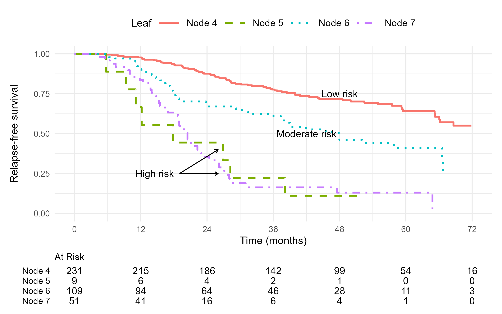{fig-align="center" width="70%"}
:::


## GBC: Random Survival Forests

- **Fitting RSF**

```{r}
#| eval: false
#| echo: true
orsf_fit <- orsf(
  Surv(time, status) ~ hormone + age + meno + size + grade + nodes + prog + estrg,
      data = train,
      n_tree = 200,
      ...
)

print(orsf_fit) 
#> ---------- Oblique random survival forest
#>      Linear combinations: Accelerated Cox regression
#>           N observations: 400
#>                 N events: 174
#>                  N trees: 200
#>       N predictors total: 8
#>    N predictors per node: 3
#>  ...
#> -----------------------------------------
```

## GBC: RSF Results

- **OOB performance and variable importance**

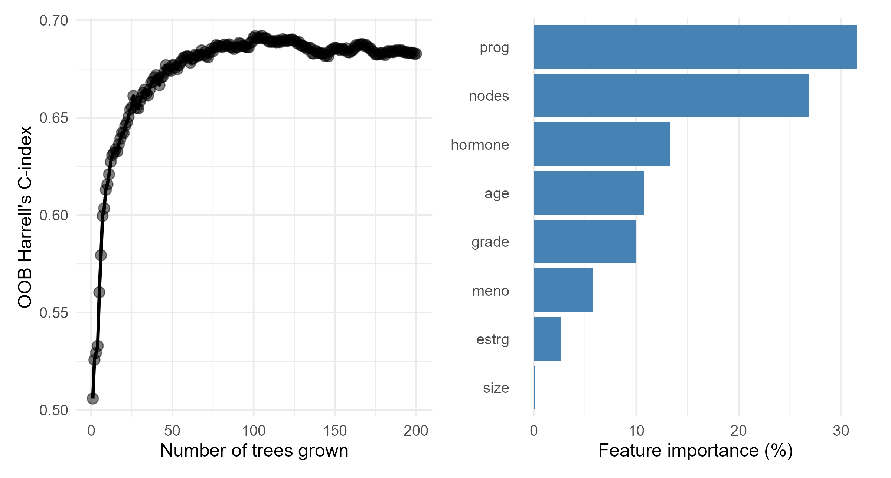{fig-align="center" width="80%"}

# Survival Support Vector Machines

## SVM for Classification

- **Classification of $Y \in \{1, -1\}$**
    - Linearly separable case
\begin{equation}\label{eq:ml:hyperplane}
\left\{
\begin{aligned}
\beta^\T Z_i \,+\, b &\,>\, 0 \quad \text{for all } Y_i = 1,\\[4pt]
\beta^\T Z_i \,+\, b &\,<\, 0 \quad \text{for all } Y_i = -1.
\end{aligned}
\right.
\end{equation}
    - **Hyperplane** $\beta^\T Z + b = 0$ separates two classes
    - **Margin**: distance from hyperplane to nearest data point
    - **SVM**: find hyperplane with maximum margin
    - **WLOS**: normalizing coefficients and centering the hyperplane
\begin{equation}\label{eq:ml:hyperplane_margin}
\left\{
\begin{aligned}
\beta^\T Z_i \,+\, b &\,\ge\, 1 \quad \text{for all } Y_i = 1,\\[4pt]
\beta^\T Z_i \,+\, b &\,\le\, -1 \quad \text{for all } Y_i = -1.
\end{aligned}
\right.
\end{equation} 
        - Distance between hyperplanes: $2\|\beta\|^{-1}$

## SVM: Maximum Margin

- **Maximum margin hyperplane**
    - Left panel: 
    $$(\hat\beta, \hat b)
\;=\;
\arg\min_{\beta, b} \|\beta\|^2
\quad\text{subject to}\quad
Y_i(\beta^\T Z_i + b) \ge 1,\;\; i = 1,\ldots,n$$

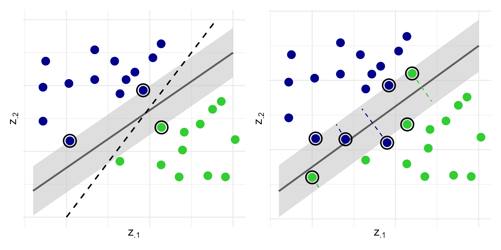{fig-align="center" width="70%"}


## SVM: Linearly Inseparable Case

- **Soft margin SVM**
    - Right panel: allow misclassification through slack variables $\zeta_i \ge 0$:
\begin{align}\label{eq:ml:svm_soft_margin}
(\hat\beta, \hat b)
\;=\;&
\arg\min_{\beta, b,\zeta} \left\{\|\beta\|^2 \,+\, \lambda\sum_{i=1}^n\zeta_i\right\}, \notag\\
&\text{subject to}\quad
\left\{
\begin{aligned}
&Y_i(\beta^\T Z_i + b) \,\ge\, 1 - \zeta_i,\\[4pt]
&\zeta_i \,\ge\, 0,
\end{aligned}
\right.
\qquad i = 1,\ldots,n
\end{align}

- **Support vectors**: data points with 
    - $\zeta_i > 0$ (misclassified)
    - $Y_i(\hat\beta^\T Z_i + \hat b) = 1$ (on margin)

## SVM: Regression (I)

- **Support vector regression**
    - Continuous $Y$: find hyperplane with $\epsilon$-insensitive loss
\begin{equation*}
(\hat\beta, \hat b)
\;=\;
\arg\min_{\beta, b} \|\beta\|^2
\quad\text{subject to}\quad
|Y_i - (\beta^\T Z_i + b)| \,\le\, \varepsilon,\;\; i = 1,\ldots,n
\end{equation*}
    - Allow for $\epsilon$-insensitive slack variables $\zeta_i^+, \zeta_i^- \ge 0$
\begin{align}\label{eq:ml:svm_soft_margin_reg}
   (\hat\beta, \hat b)
\;=\;&
\arg\min_{\beta, b, \xi^+, \xi^-}
\left\{
\|\beta\|^2 \,+\, 
\lambda\sum_{i=1}^n(\xi_i^+ + \xi_i^-)
\right\}, \notag\\[3pt]
&\text{subject to}\quad
   \left\{
\begin{aligned}
&Y_i - (\beta^\T Z_i + b) \,\le\, \varepsilon + \xi_i^+,\\[3pt]
&(\beta^\T Z_i + b) - Y_i \,\le\, \varepsilon + \xi_i^-,\\[3pt]
&\xi_i^+,\,\xi_i^- \,\ge\, 0,
\end{aligned}
\right.
\qquad i = 1,\ldots,n
\end{align}    

## SVM: Regression (II)

- **Hard versus soft margin**

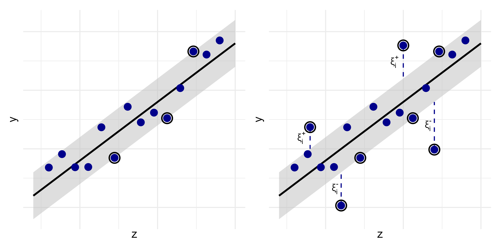{fig-align="center" width="80%"}


## Survival SVM (I)

- **Two perspectives**
    - Ranking: order classification of comparable pairs
    $$
\mathcal P \;=\; \{(i, j):\, \delta_i = 1,\, X_i < X_j\}.
$$
    - Regression: predict survival time with censored data

- **Ranking SSVM**
    - Classification with soft margin
\begin{align}\label{eq:ml:svm_soft_margin_surv}
   \hat\beta
\;=\;&
\arg\min_{\beta, \zeta} \|\beta\|^2 \,+\, \lambda\sum_{(i, j)\in\mathcal P} \zeta_{ij}, \notag\\
&\text{subject to}\quad
   \left\{
\begin{aligned}
&\beta^\T (Z_i - Z_j) \,\ge\, 1 - \zeta_{ij},\\[4pt]
&\zeta_{ij} \,\ge\, 0,
\end{aligned}
\right.
\qquad (i, j)\in\mathcal P
\end{align}


## Survival SVM (II)

- **Regression SSVM**
    - Censored observations $\to$ one-sided penalty
\begin{align}\label{eq:ml:svm_soft_margin_reg_surv}
   (\hat\beta, \hat b)
\;=\;&
\arg\min_{\beta, b, \xi^+, \xi^-}
\left\{
\|\beta\|^2 \,+\,
\lambda\sum_{i=1}^n(\xi_i^+ + \xi_i^-)
\right\}, \notag\\[3pt]
&\text{subject to}\quad
   \left\{
\begin{aligned}
&X_i - (\beta^\T Z_i + b) \,\le\, \xi_i^+,\\[3pt]
&\delta_i\{\beta^\T Z_i + b - X_i\} \,\le\, \xi_i^-,\\[3pt]
&\xi_i^+,\,\xi_i^- \,\ge\, 0,
\end{aligned}
\right.
\qquad i = 1,\ldots,n
\end{align}

## Survival SVM (III)

- **Hybrid approach**
    - Combines ranking and regression objective functions and penalties
\begin{align}\label{eq:ml:svm_soft_margin_hybrid_surv}
   (\hat\beta, \hat b)
\;=\;&
\arg\min_{\beta, b, \zeta, \xi^+, \xi^-}
\left\{
\|\beta\|^2
\,+\,
\mu\sum_{(i,j)\in\mathcal P} \zeta_{ij}
\,+\,
\gamma\sum_{i=1}^n(\xi_i^+ + \xi_i^-)
\right\}, \notag\\[3pt]
&\text{subject to}\quad
   \left\{
\begin{aligned}
&\beta^\T (Z_i - Z_j) \,\ge\, 1 - \zeta_{ij},\\[2pt]
&\zeta_{ij} \,\ge\, 0,
\end{aligned}
\right.
\qquad (i, j)\in\mathcal P, \notag\\[4pt]
&\quad\quad\;\text{and}\quad
   \left\{
\begin{aligned}
&X_i - (\beta^\T Z_i + b) \,\le\, \xi_i^+,\\[3pt]
&\delta_i\{\beta^\T Z_i + b - X_i\} \,\le\, \xi_i^-,\\[3pt]
&\xi_i^+,\,\xi_i^- \,\ge\, 0,
\end{aligned}
\right.
\qquad i = 1,\ldots,n.
\end{align}

## The Kernel Trick

- **Nonlinear SVM**
    - Map covariates to high-dimensional space: $z\mapsto \phi(z)$
    - Use kernel function $K(z, z') = \langle \phi(z), \phi(z')\rangle$ to compute inner products
    - Common kernels: linear, polynomial, radial basis function (RBF)

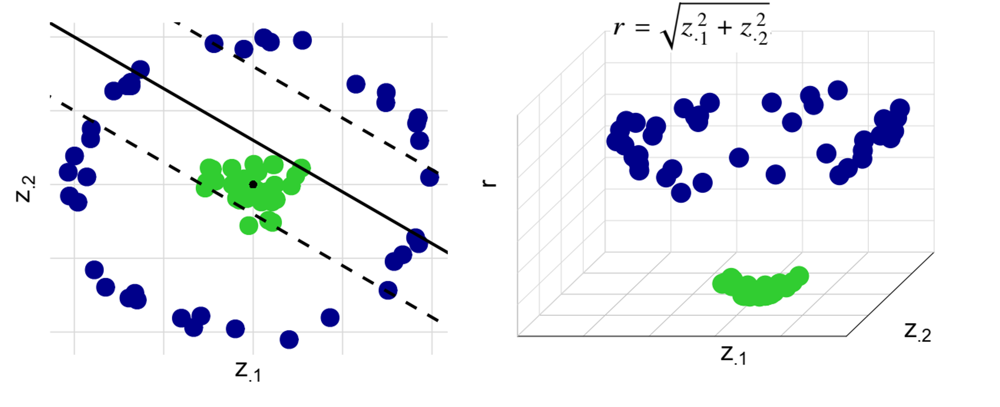{fig-align="center" width="75%"}

## Software: `survivalsvm::survivalsvm()` (I)

- **Basic syntax for fitting survival SVM**
    - `type`: "ranking", "regression", or "hybrid"
    - `kernel`: "linear", "polynomial", or "radial"
    - `gamma.mu`: tuning parameters $\gamma$ and $\mu$ for hybrid SVM

```{r}
#| eval: false
#| echo: true
library(survivalsvm)
# Fit a regression SVM with linear kernel
fit <- survivalsvm(
  Surv(time, status) ~ covariates, 
  type = "regression",
  kernel = "linear",
  gamma.mu = 1       # may need to be tuned manually
)
```


## Software: `survivalsvm::survivalsvm()` (II)

- **Predict risk scores**

```{r}
#| eval: false
#| echo: true
# Predict risk scores for test set (<test_scaled>)
pred_svm <- predict(
  object  = fit,
  newdata = test
)

# Extract predicted scores
pred_svm$predicted
```


## GBC: Fitting SSVM

- **Regression with linear kernel**
    - Feature importance computed from CV samples

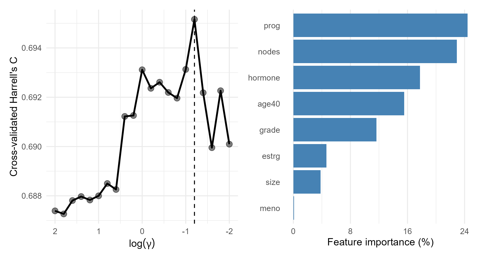{fig-align="center" width="75%"}

## GBC: Models Fitted

- **Models**
    - Full Cox model with all predictors
    - "Inadequate" Cox model excluding `prog` and `nodes`
    - Lasso-regularized Cox model
    - Survival tree
    - Random survival forest
    - Survival SVM
    
    
## GBC: Model Evaluations 

- **Prediction performance on test data** ($n^*=286$)

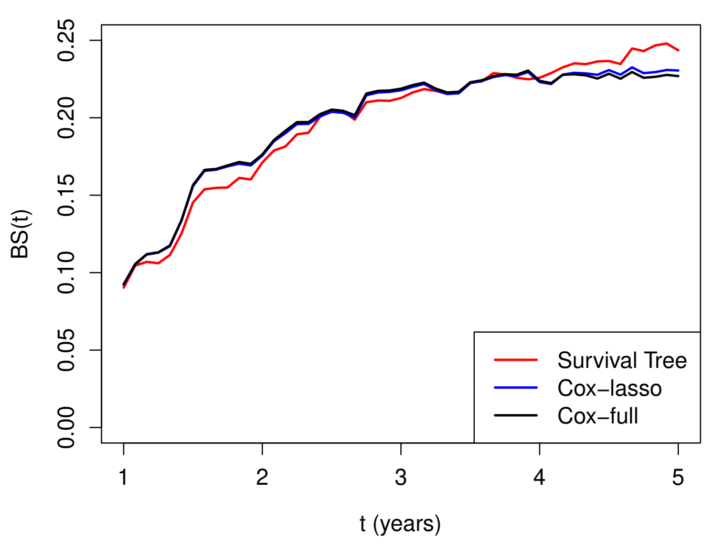{fig-align="center" width="100%"}

## GBC: Brier Score

- **Brier score over time**

<!-- ml_brier_scores_all_models -->
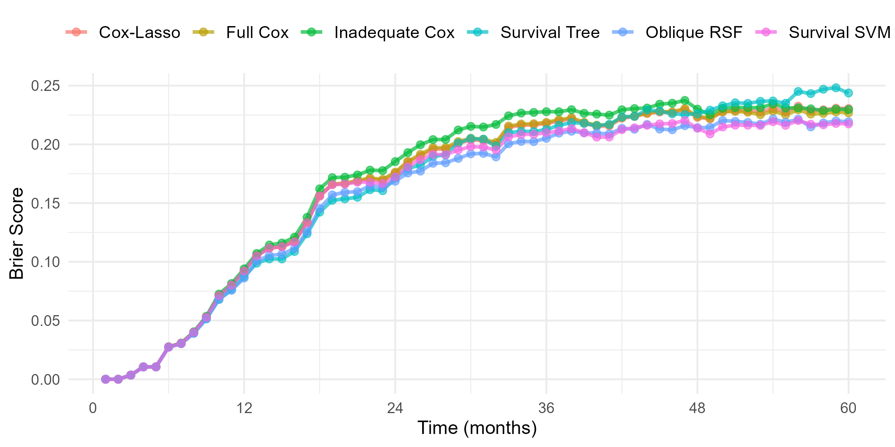{fig-align="center" width="90%"}

# R's Tidymodels System

## Overview of `tidymodels` and `censored`

-   **`tidymodels`**: a collection of packages for modeling and machine learning in R
    -   Provides a *consistent interface* for model training, tuning, and evaluation
        -   Key package `parsnip`
    -   Supports various model types, including regression, classification, and survival analysis
-   **`censored`**: a `parsnip` extension package for survival data
    -   Implements parametric, semiparametric, and tree-based survival models

## Data Preparation and Splitting

-   **Create a `Surv` object** as response
    -   `Surv(time, event)`

```{r}
#| eval: false
#| echo: true
library(tidymodels)
library(censored)
df <- df |>  
  mutate(
    surv_obj = Surv(time, event), # create Surv object as response variable
    .keep = "unused"              # discard original time and event columns
  )
```

-   **Data splitting**

    -   `initial_split()`: splits data into training and testing sets

```{r}
#| eval: false
#| echo: true
df_split <- initial_split(flight_data, prop = 3/4) # default ratio 3:1
df_train <- training(df_split) # obtain training set
```


## Model Specification

-   **Model type**
    -   `survival_reg()`: parametric AFT models
    -   `proportional_hazards(penalty = tune())`: (regularized) Cox PH models
    -   `decision_tree(cost_complexity = tune())`: decision trees
    -   `rand_forest(mtry = tune())`: orandom forests
-   **Set engine and mode**
    -   `set_engine("survival")`: for parametric AFT models
    -   `set_engine("glmnet")`: for Cox PH models
    -   `set_engine("aorsf")`: for blique random forests
    -   `set_mode("censored regression")`: for survival models


## Model Specification - Example

- **Example**: regularized Cox model using `glmnet`

```{r}
#| eval: false
#| echo: true
# Regularized Cox model 
model_spec <- proportional_hazards(penalty = tune()) |>  # tune lambda
  set_engine("glmnet") |>  # set engine to glmnet
  set_mode("censored regression") # set mode to censored regression
```

## Recipe and Workflow 

-   **Recipe**: a series of preprocessing steps for the data
    -   `recipe(response ~ ., data = df)`: specify response and predictors
    -   `step_mutate()`: standardize numeric predictors <!-- -  `step_unknown()`: handle unknown levels in categorical variables --> <!-- -  `step_other()`: group low-frequency levels into "other" -->
    -   `step_dummy()`: convert categorical variables to dummy variables <!-- -  `step_zv()`: remove zero-variance predictors -->
-   **Workflow**: combines model specification and recipe
    -   `workflow() |> add_model(model_spec) |> add_recipe(recipe)`


## Recipe and Workflow - Example

-  **Example**: regularized Cox model with data preprocessing steps

```{r}
#| eval: false
#| echo: true
# Create a recipe
model_recipe <- recipe(surv_obj ~ ., data = df_train) |> # specify formula
  step_mutate(z1 = z1 / 1000) |>  # standardize z1  
  # group levels with prop < .02 into "other"
  step_other(z2, z3, threshold = 0.02) |> 
  # convert categorical WWto dummy variables
  step_dummy(all_nominal_predictors())  

# Create a workflow by combining model and recipe
model_wflow <- workflow() |> 
  add_model(model_spec) |>   # add model specification
  add_recipe(model_recipe)   # add recipe
```

## Tune Hyperparameters

-   **Cross-validation**
    -   `df_train_folds <- vfold_cv(df_train, v = k)`: create *k*-folds on training data (default 10)
    -   `tune_grid(model_wflow, resamples = df_train_folds)`: tuning

```{r}
#| eval: false
#| echo: true
# k-fold cross-validation
df_train_folds <- vfold_cv(df_train, v = 10) # 10-fold cross-validation
# Tune hyperparameters
model_res <- tune_grid(
  model_wflow, 
  resamples = df_train_folds, 
  grid = 10, # number of hyperparameter combinations to try
  metrics = metric_set(brier_survival, brier_survival_integrated,  
                       roc_auc_survival, concordance_survival), # specify metrics
  eval_time = seq(0, 84, by = 12) # evaluation time points
)
```


## Finalize Workflow

-   **Examine validation results**
    -   `collect_metrics(model_res)`: collect metrics from tuning results
    -   `show_best(model_res, metric = "brier_survival_integrated", n = 5)`: show top 5 models based on IBS
-   **Workflow for best model**
    -   `param_best <- select_best(model_res, metric = "brier_survival_integrated")`: select best hyperparameters based on Brier score
    -   `final_wl <- finalize_workflow(model_wflow, param_best)`: finalize workflow with best hyperparameters


## Finalize Workflow - Example

- **Example**: select best hyperparameters based on Brier score and finalize workflow

```{r}
#| eval: false
#| echo: true
# Extract the best hyperparameters based on Brier score
param_best <- select_best(model_res, metric = "brier_survival_integrated")

# Finalize the workflow with the best hyperparameters
final_wl <- model_wflow |> finalize_workflow(param_best)
```


## Fit Final Model

-   **Fit the finalized workflow**
    -   `final_mod <- last_fit(final_wl, split = df_split)`: fit the finalized workflow on the testing set
    -   `collect_metrics(final_mod)`: collect metrics of final model on test data
-   **Make predictions**
    -   `predict(final_mod, new_data = new_data, type = "time")`: predict survival times on new data

## Fit Final Model - Example

- **Example**: fit the finalized workflow on the testing set, evaluate performance, and make predictions on new data

```{r}
#| eval: false
#| echo: true
# Fit the finalized workflow on the testing set
final_mod <- last_fit(final_wl, split = df_split)

# Collect metrics of final model on test data
collect_metrics(final_mod) %>% 
  filter(.metric == "brier_survival_integrated")

# Make predictions on new data
new_data <- testing(df_split) |>  slice(1:5) # take first 5 rows of test data
predict(final_mod, new_data = new_data, type = "time")
```

# A Case Study for Tidymodels

## GBC: Relapse-Free Survival

-   **Time to first event**

```{r}
#| eval: true
#| echo: true
library(tidymodels) # load tidymodels
library(censored)
gbc <- read.table("Data/German Breast Cancer Study/gbc.txt", header = TRUE) # Load GBC dataset
df <- gbc |>  # calculate time to first event (relapse or death)
  group_by(id) |> # group by id
  arrange(time) |> # sort rows by time
  slice(1) |>      # get the first row within each id
  ungroup() |> 
  mutate(
    surv_obj = Surv(time, status), # create the Surv object as response variable
    .after = id, # keep id column after surv_obj
    .keep = "unused" # discard original time and status columns
  )

```

## Data Preparation

-   **Analysis dataset**

```{r}
#| eval: true
#| echo: true
head(df) # show the first few rows of the dataset
```

```{r}
#| eval: true
#| echo: true
# Data splitting
set.seed(123) # set seed for reproducibility
gbc_split <- initial_split(df) # split data into training and testing sets
gbc_split 
```

## Models to be Trained

-   **Regularized Cox model**
    -   `proportional_hazards(penalty = tune())` (Default: $\alpha = 1$; lasso)
    -   Tune penalty parameter $\lambda$
    -   Use `glmnet` engine for fitting
-   **Random forest**
    -   `rand_forest(mtry = tune(), min_n = tune())`
    -   Tune number of predictors to split on and minimum size of terminal node
    -   Use `aorsf` engine for fitting

```{r}
#| eval: true
#| echo: true
# Training data
gbc_train <- training(gbc_split) # obtain training set
```

## Common Recipe

-   **Recipe for both models** <!-- -  Create binary variable for age $\geq 40$ --> <!-- -  Rescale `prog` and `estrg` by 0.01 --> <!-- -  Convert `grade` to dummy variables -->

```{r}
#| eval: true
#| echo: true

gbc_recipe <- recipe(surv_obj ~ ., data = gbc_train) |> # specify formula
  step_mutate(
    grade = factor(grade),
    age40 = as.numeric(age >= 40), # create a binary variable for age >= 40
    prog = prog / 100, # rescale prog
    estrg = estrg / 100 # rescale estrg
  ) |> 
  step_dummy(grade) |> 
  step_rm(id) # remove id
# gbc_recipe # print recipe information
```


## Regularized Cox Model

-   **Cox model specification and workflow**

```{r}
#| eval: true
#| echo: true
# Regularized Cox model specification
cox_spec <- proportional_hazards(penalty = tune()) |>  # tune lambda
  set_engine("glmnet") |>  # set engine to glmnet
  set_mode("censored regression") # set mode to censored regression
cox_spec # print model specification
# Create a workflow by combining model and recipe
cox_wflow <- workflow() |> 
  add_model(cox_spec) |>   # add model specification
  add_recipe(gbc_recipe)   # add recipe
```

## Model Tuning

-   **Cross-validation set-up**

```{r}
#| eval: true
#| echo: true
set.seed(123) # set seed for reproducibility
gbc_folds <- vfold_cv(gbc_train, v = 10) # 10-fold cross-validation
# Set evaulation metrics
gbc_metrics <- metric_set(brier_survival, brier_survival_integrated, 
                          roc_auc_survival, concordance_survival)
gbc_metrics # evaluation metrics info
time_points <- seq(0, 84, by = 12) # evaluation time points
```

## Cox Model Tuning

-   **Tune the regularized Cox model**
    -   Use `tune_grid()` to perform hyperparameter tuning
    -   Evaluate performance using Brier score and ROC AUC

```{r}
#| eval: false
#| echo: true
set.seed(123) # set seed for reproducibility
# Tune the regularized Cox model (this will take some time)
cox_res <- tune_grid(
  cox_wflow, 
  resamples = gbc_folds, 
  grid = 10, # number of hyperparameter combinations to try
  metrics = gbc_metrics, # evaluation metrics
  eval_time = time_points, # evaluation time points
  control = control_grid(save_workflow = TRUE) # save workflow
)
```

```{r}
#| eval: false
#| echo: false
saveRDS(cox_res, "data/cox_res.rds") # save the tuning results
```


```{r}
#| eval: true
#| echo: false
# Load the tuning results
cox_res <- readRDS("data/cox_res.rds") # load the tuning results
```


## Cox Model Tuning Results

-   Plot IBS as function of $\log\lambda$

```{r}
#| eval: true
#| fig-width: 8
#| fig-height: 4
#| fig-align: "center"
collect_metrics(cox_res) |>  # collect metrics from tuning results
  filter(.metric == "brier_survival_integrated") |>  # filter for Brier score
  ggplot(aes(log(penalty), mean)) + # plot log-lambda vs Brier score
  geom_line() +  # plot line
  labs(x = "Log-lambda", y = "Integrated Brier Score") + # labels
  theme_classic() # classic theme
```

## Best Cox Models

-   **Show best models**
    -   Based on Brier score

    ```{r}
    #| echo: true
    #| eval: true
    show_best(cox_res, metric = "brier_survival_integrated", n = 5) # top 5 models
    ```


## Random Forest Model

-   **Random forest specification and workflow**

```{r}
#| eval: true
#| echo: true

# Random forest model specification
rf_spec <- rand_forest(mtry = tune(), min_n = tune()) |>  # tune mtry and min_n
  set_engine("aorsf") |>  # set engine to aorsf
  set_mode("censored regression") # set mode to censored regression
rf_spec # print model specification
# Create a workflow by combining model and recipe
rf_wflow <- workflow() |> 
  add_model(rf_spec) |>   # add model specification
  add_recipe(gbc_recipe)   # add recipe
```

## Random Forest Tuning

-   **Tune the random forest model**
    -   Similar to Cox model tuning

```{r}
#| eval: false
#| echo: true

set.seed(123) # set seed for reproducibility
# Tune the random forest model (this will take some time)
rf_res <- tune_grid(
  rf_wflow, 
  resamples = gbc_folds, 
  grid = 10, # number of hyperparameter combinations to try
  metrics = gbc_metrics, # evaluation metrics
  eval_time = time_points # evaluation time points
)

```

```{r}
#| echo: false
#| eval: false
saveRDS(rf_res, "data/rf_res.rds") # save the tuning results

```

```{r}
#| eval: true
#| echo: false
# Load the tuning results
rf_res <- readRDS("data/rf_res.rds") # load the tuning results
```


## Random Forest Tuning Results

-   **View validation results**

```{r}
#| eval: true
#| echo: true
collect_metrics(rf_res) |> head()   # collect metrics from tuning results
```

## Best Random Forest Models

-   **Show best models**
    -   Based on Brier score

```{r}
#| eval: true
#| echo: true
show_best(rf_res, metric = "brier_survival_integrated", n = 5) # top 5 models
```

-   **Conclusion**
    -   Best RF model has lower Brier score than best Cox model

## Finalize and Fit Best Model

-   **Fit final RF model**

```{r}
#| eval: true
#| echo: true
# Select best RF hyperparameters (mtry, min_n) based on Brier score
param_best <- select_best(rf_res, metric = "brier_survival_integrated") 
param_best # view results

rf_final_wflow <- finalize_workflow(rf_wflow, param_best) # Finalize workflow
# Fit the finalized workflow on the testing set
set.seed(123) # set seed for reproducibility
final_rf_fit <- last_fit(
  rf_final_wflow, 
  split = gbc_split, # use the original split
  metrics = gbc_metrics, # evaluation metrics
  eval_time = time_points # evaluation time points
)
```

## Test Performance (I)

-   **Collect metrics on test data**

```{r}
#| eval: true
#| echo: true
collect_metrics(final_rf_fit) |> # collect overall performance metrics
  filter(.metric %in% c("concordance_survival", "brier_survival_integrated")) 
# Extract test ROC AUC over time
roc_test <- collect_metrics(final_rf_fit) |>  
  filter(.metric == "roc_auc_survival") |>  # filter for ROC AUC
  rename(mean = .estimate) # rename mean column
```

## Test Performance (II)

-   **Plot test ROC AUC over time**

```{r}
#| eval: true
#| fig-width: 8
#| fig-height: 4
#| fig-align: "center"
roc_test |>  # pass the test ROC AUC data
  ggplot(aes(.eval_time, mean)) +  # plot evaluation time vs mean ROC AUC
  geom_line() + # plot line
  labs(x = "Time (months)", y = "ROC AUC") + # labels
  theme_classic()
```

## Prediction by Final RF Model

-   **Extract the fitted workflow**
    -   Use `extract_workflow()` to get the final model

```{r}
#| eval: true
#| echo: true
gbc_rf <- extract_workflow(final_rf_fit) # extract the fitted workflow
# Predict on new data
gbc_5 <- testing(gbc_split) |>  slice(1:5) # take first 5 rows of test data
predict(gbc_rf, new_data = gbc_5, type = "time") # predict survival times
```


## Survival Tree Exercise

-   **Task**: fit a survival tree model to the GBC data
    -   Use `decision_tree()` with `set_engine("rpart")`
    -   Tune complexity parameter `cost_complexity` using `tune()`
    -   Use the same recipe as for Cox and RF models
    -   Evaluate performance using Brier score and ROC AUC
    
    
# Conclusion

## Notes (I)

-   **The lasso**
    -   First proposed by Tibshirani (1996) for least-squares
    -   Extended to Cox model by Tibshirani (1997)
    -   Algorithms for $L_1$-regularized Cox model described in Simon et al. (2011)
-   **Variations**
    -   group lasso (Yuan and Lin, 2006)
    -   adaptive lasso (Zou, 2006)
    -   smoothly clipped absolute deviations (SCAD; Xie and Huang, 2009)
-   **Elastic net for win ratio**
    -   [WRnet](https://doi.org/10.1186/s12874-025-02554-w) (Mao, 2025)

## Notes (II)

:::::: columns
:::: {.column width="60%"}
::: {style="font-size: 98%"}
-   **More on decision trees**
    -   **Text**: Breiman et al. (1984)
    -   **Review article**: Bou-Hamad et al. (2011, *Statistics Surveys*)
-   **Bagging and random forests** (R-packages)
    -   `ipred`
    -   `randomSurvivalForest`
    -   `ranger`
:::
::::

::: {.column width="40%"}
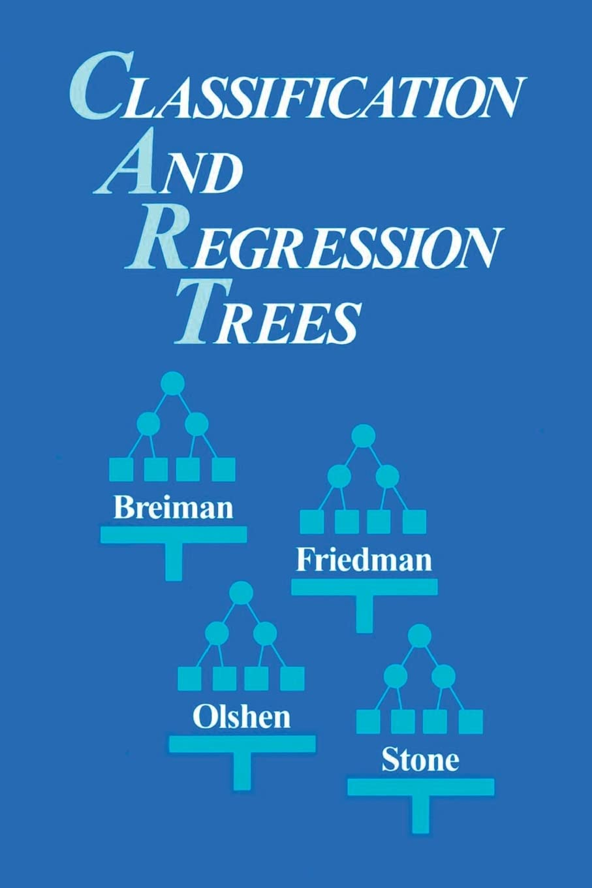{fig-align="center" width="80%"}
:::
::::::

## Notes (III)

- **Python’s machine learning systems**
    -   `scikit-learn`: general machine learning library with support for survival analysis through extensions like `scikit-survival`
    -   `lifelines`: library specifically for survival analysis, including Cox models and KM estimators
    -   `xgboost` and `lightgbm`: gradient boosting libraries adaptable for survival analysis using custom loss functions

- **Deep learning in survival analysis**
    -   `DeepSurv`: a deep learning-based Cox proportional hazards model
    -   `DeepHit`: a deep learning model for competing risks survival analysis


## Summary (I)

-   **Regularized Cox model**
    -   **Elastic net** $$
        Q_n(\beta;\lambda) = \ell_n(\beta) - \lambda\left\{\alpha\|\beta\|_1 + (1-\alpha)\|\beta\|_2^2/2\right\}
        $$
        -   `glmnet::glmnet(Z, Surv(time, status), family =  “cox”, alpha = 1)`
-   **Survival trees**
    -   Root node $\to$ recursive partitioning based on similarity in outcome $\to$ pruning to prevent overfitting
        -   `rpart:: rpart(Surv(time, status) ~ covariates)`

## Summary (II)

-  **Random survival forests**
    -   Ensemble of survival trees with random feature selection and bootstrap 
        -   `aorsf:: aorsf(Surv(time, status) ~ covariates, n_tree = 200)`

-   **Survival SVM**
    -   Extension of SVM for survival data using ranking or regression approaches
    
-  **R's `tidymodels` system**
    -   A consistent interface for model training, tuning, and evaluation
    -   `censored` package extends `parsnip` for survival models