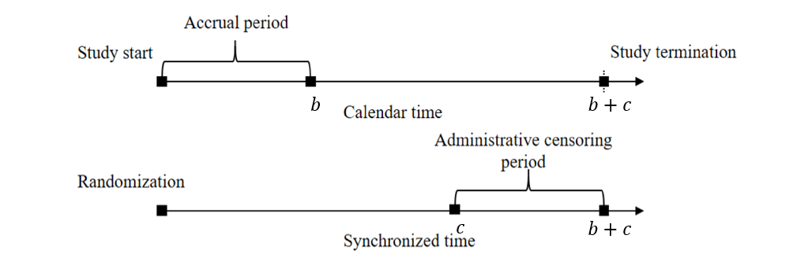

## Slides

Lecture slides [here](chap6.html){target="_blank"}. (To convert html to pdf, press E $\to$ Print $\to$ Destination: Save to pdf)

## Chapter Summary

Determining an appropriate sample size is a crucial step in designing a time-to-event study. Inadequate sample size can lead to insufficient power, while an overpowered study may waste resources. As two most important methods in survival analysis, the *log-rank test* (or equivalently, a Cox model with a binary predictor) and *restricted mean survival time (RMST)* analysis need special attanetion. In their sample size calculations, study design choices—such as accrual patterns, length of follow-up, and loss to follow-up assumptions—play an important role.

### General approach to sample size calculation

A common starting point is to consider a test statistic $S_n=\sqrt n T_n /\hat\sigma_n$ that is approximately standard normal under the null hypothesis. Define a minimal clinically important effect size $\theta$ (e.g., a targeted log-hazard ratio or a difference in RMST) and specify the desired power $\gamma$. The general form for the required sample size, under asymptotic normality, often reduces to

$$
n 
\;=\; 
\frac{\sigma_0^2\,\bigl(z_{1-\alpha/2} \,+\, z_\gamma\bigr)^2}{f(\theta)^2},
$$

where $f(\theta) = E(T_n)$ is the “signal” contributed by the effect size, $\sigma_0^2$ is the variance term under the null, and $z_{p}$ is the $p$-quantile of the standard normal distribution. Intuitively, stronger signals $\bigl|f(\theta)\bigr|$ reduce the required $n$, while higher variance $\sigma_0^2$ or more stringent significance/power criteria increase $n$.

### Schoenfeld’s formula for the Cox (log-rank) test

Under a proportional hazards model with a binary treatment: $$
\lambda(t \mid Z=1) 
\;=\; 
\lambda_0(t)\,\exp(\theta),
$$ the log-rank test statistic has a well-known large-sample result leading to **Schoenfeld’s formula**:

\begin{equation}\label{eq:cox:sample_size}
n 
\;=\; 
\frac{\bigl(z_{1-\alpha/2} + z_\gamma\bigr)^2}{q(1-q)\,\psi\,\theta^2}, \tag{1}
\end{equation}

where:

-   $q$ is the proportion allocated to treatment,
-   $\theta$ is the log-hazard ratio ($\theta=0$ under the null),
-   $\psi$ is the expected proportion of events (failures).

Alternatively, we can express $n\psi$, the total number of events, as the right-hand side of \eqref{eq:cox:sample_size} without $\psi$ in the denominator. You often hear this referred to as an “event-driven” calculation—knowing the total number of events required can be more important than total enrollment.

### Sample size for RMST

The *restricted mean survival time* (RMST) over $[0, \tau]$ captures the average time lived up to $\tau$. For a two-sample comparison, the difference $\theta(\tau) = \mu_1(\tau) - \mu_0(\tau)$ can be tested, by its estimator $\hat\theta(\tau)$. The corresponding sample size formula is:

\begin{equation}\label{eq:rmst:sample_size}
n 
\;=\; 
\frac{\zeta(\tau)\,\bigl(z_{1-\alpha/2} + z_\gamma\bigr)^2}{
  q(1-q)\,\theta(\tau)^2}, \tag{2}
\end{equation}

where $\zeta(\tau)$ is a variance-related term (depending on survival and censoring distributions). While slightly less efficient under strict proportional hazards, RMST-based tests offer a direct interpretation of how many additional months or years are gained under one treatment arm compared to another.

### Study design and its impact

Study design considerations—*uniform accrual* over $b$ years, additional follow-up $c$ years after accrual closes, and potential *exponential loss to follow-up*—shape the computations of $\psi$ (for log-rank) and $\zeta(\tau)$ (for RMST) through the *censoring distribution*.

{fig-align="center" width="75%"}

Under this set-up:

1.  **Administrative censoring**: Uniform$[c, b + c]$
2.  **Loss to follow-up**: Assume exponential dropout with rate $\lambda_L$.

These assumptions feed into analytic or numerical formulas to calculate:

-   Censoring survival function \begin{equation}\label{eq:design:censoring}
        G(t;\lambda_L, b, c):=\mathrm{pr}(C>t)=\left\{\begin{array}{ll} \exp(-\lambda_L t)& 0\leq t\leq c\\
        b^{-1}(c+b-t)\exp(-\lambda_L t) & c<t<c+b \\
        0& t\geq c+b.
        \end{array}\right.
        \end{equation}
-   $\psi$ for log-rank (closed-form) \begin{equation}\label{eq:cox:psi}
            \psi=\frac{\lambda_0}{\lambda_0+\lambda_L}\left[1-\exp\{-(\lambda_0+\lambda_L)c\}
            \frac{1-\exp\{-(\lambda_0+\lambda_L)b\}}{(\lambda_0+\lambda_L)b}\right]
            \end{equation}
-   $\zeta(\tau)$ for RMST (needs numerical integration) \begin{equation}\label{eq:design:rmst_zeta}
            \zeta(\tau)=\lambda_0^{-1}\int_0^\tau\{\exp(-\lambda_0 t)-\exp(-\lambda_0 \tau)\}^2\exp(\lambda_0 t)G(t;\lambda_L, b, c)^{-1}\mathrm{d} t
            \end{equation}
-   Plug $\psi$ or $\zeta(\tau)$ back into sample size formulas \eqref{eq:cox:sample_size} or \eqref{eq:rmst:sample_size}, respectively.

### A general implementation

The R package `npsurvSS` offers more general routines for sample size/power calculations under log-rank and RMST approaches. Suppose we hypothesize an exponential event rate $\lambda_0$ in the control group and a hazard ratio $\mathrm{HR} = \exp(\theta)$ in the treatment group:

```{r}
#| eval: false

# Install if needed
# install.packages("npsurvSS")

library(npsurvSS)

# 1. Define arms (control vs. treatment) for a two-arm study
control <- create_arm(size = 500,
                      accr_time = 2,     # uniform accrual over 2 years
                      follow_time = 3.5, # then followed 3.5 years
                      surv_scale = 0.174,  # baseline hazard for event
                      loss_scale = 0.01)   # hazard of loss to follow-up

treatment <- create_arm(size = 500,
                        accr_time = 2,
                        follow_time = 3.5,
                        surv_scale = 0.174 * 0.8, # hazard ratio = 0.8
                        loss_scale = 0.01)

# 2. Compute required sample size for different tests
res_size <- size_two_arm(
  control, 
  treatment,
  test = list(
    list(test = "weighted logrank"),               # log-rank 
    list(test = "rmst difference", milestone = 3), # RMST at 3 years
    list(test = "rmst difference", milestone = 5)  # RMST at 5 years
  )
)

print(res_size)
```

You can customize the accrual pattern (piecewise uniform or otherwise), use Weibull rather than exponential survival times, or request sample size for alternative tests (e.g., Gehan–Wilcoxon, RMST ratio, survival probability difference).

### Conclusion

Planning a time-to-event study involves balancing the feasibility of enrolling and following patients against the power to detect a meaningful effect. Schoenfeld’s formula under the proportional hazards framework yields intuitive “event-driven” calculations, while RMST-based approaches similarly ensure adequate power for differences in average time lived within a specified window. Because design factors—accrual, follow-up length, and dropout processes—directly enter these formulas, it is vital to specify reasonable assumptions and possibly refine them via pilot data.

## R code

```{r}
#| code-fold: true
#| code-summary: "Show the code"
#| eval: false

###############################################################################
# Chapter 6 R Code
#
# This script reproduces major numerical results in Chapter 6, including
#   1. Functions for sample size calculations (psi_fun, zeta_fun)
#   2. Numerical examples for RMST variance components
#   3. Sample size computations using the GBC pilot data
###############################################################################

# =============================================================================
# (A) Functions Needed for Sample Size Calculation
# =============================================================================

# -----------------------------------------------------------------------------
# 1. psi_fun(lambda0, lambdaL, b, c)
# -----------------------------------------------------------------------------
# Computes the proportion of observed failures (psi) under
#   - exponential event time with hazard lambda0
#   - exponential loss to follow-up with hazard lambdaL
#   - uniform accrual over [0, b] and additional follow-up length c
psi_fun <- function(lambda0, lambdaL, b, c) {
  # Total hazard for "leaving the risk set" due to event or LTFU
  lambda <- lambda0 + lambdaL

  # Closed-form expression for Pr(T <= C) under the design assumptions
  psi <- lambda0 / lambda * (
    1 - exp(-lambda * c) * (1 - exp(-lambda * b)) / (lambda * b)
  )

  return(psi)
}

# -----------------------------------------------------------------------------
# 2. zeta_fun(tau, lambda0, lambdaL, b, c)
# -----------------------------------------------------------------------------
# Computes the design-dependent variance component (zeta) for RMST
# sample size calculations via numerical integration.
#
# The function uses:
#   - Gfun(t): survival function for censoring under uniform accrual + admin censoring
#   - zeta_integrand(t): integrand derived from the large-sample variance of RMST

# Censoring survival function G(t) under:
#   - exponential LTFU with hazard lambdaL
#   - administrative censoring induced by accrual length b and follow-up c
Gfun <- function(t, lambdaL, b, c) {
  # Piecewise form: before admin censoring (t <= c), during admin censoring (c < t < c+b),
  # and after study end (t >= c+b)
  Gt <- ifelse(
    t <= c,
    exp(-lambdaL * t),
    ifelse(
      t < (c + b),
      exp(-lambdaL * t) * (b + c - t) / b,
      0
    )
  )

  return(Gt)
}

# Integrand for zeta(tau): depends on event hazard, censoring survival, and truncation time
zeta_integrand <- function(t, tau, lambda0, lambdaL, b, c) {
  # (S(t) - S(tau))^2 / {G(t) * lambda0 * S(t)} under exponential S(t) = exp(-lambda0 t)
  integrand <- (exp(-lambda0 * t) - exp(-lambda0 * tau))^2 *
    exp(lambda0 * t) / (Gfun(t, lambdaL, b, c) * lambda0)

  return(integrand)
}

# Main zeta function computed by numerical integration from 0 to tau
zeta_fun <- function(tau, lambda0, lambdaL, b, c) {
  # Wrap integrand with fixed parameters so integrate() varies only t
  f <- function(t) {
    zeta_integrand(t, tau, lambda0, lambdaL, b, c)
  }

  # Numerical integral
  zeta <- integrate(f, lower = 0, upper = tau)

  return(zeta$value)
}

# =============================================================================
# (B) Numerical Results for RMST Variance Component
# =============================================================================

# Evaluate zeta_fun at a specific configuration
zeta_fun(tau = 5, lambda0 = 0.2, lambdaL = 0.01, b = 2, c = 4)

# =============================================================================
# (C) Sample Size Calculation Example with GBC Data
# =============================================================================
library(survival) # Surv objects for extracting pilot event rates

# -----------------------------------------------------------------------------
# 1. Read GBC data and construct a pilot subgroup
# -----------------------------------------------------------------------------
gbc <- read.table("Data//German Breast Cancer Study//gbc.txt")

# Sort by subject id and time, then keep the first record per subject
o   <- order(gbc$id, gbc$time)
gbc <- gbc[o, ]
df  <- gbc[!duplicated(gbc$id), ]

# Collapse event types into a single event indicator
df$status <- (df$status > 0) + 0

# Pilot subgroup: post-menopausal (meno == 2) and no hormone therapy (hormone == 1)
pilot <- df[df$meno == 2 & df$hormone == 1, ]
n <- nrow(pilot)

# -----------------------------------------------------------------------------
# 2. Estimate baseline event hazard and define design parameters
# -----------------------------------------------------------------------------
# Convert months to years for design calculations
pilot$time <- pilot$time / 12

# Exponential MLE for hazard: total events / total follow-up time
lambda0 <- sum(pilot$status > 0) / sum(pilot$time)

# Design assumptions for accrual and follow-up
lambdaL <- 0.01  # loss-to-follow-up hazard
b <- 2           # accrual length (years)
c <- 3.5         # additional follow-up after accrual ends (years)

# Compute psi (event proportion) and zeta (RMST variance component) at tau = 3 and 5
psi   <- psi_fun(lambda0, lambdaL, b, c)
zeta3 <- zeta_fun(tau = 3, lambda0, lambdaL, b, c)
zeta5 <- zeta_fun(tau = 5, lambda0, lambdaL, b, c)

# -----------------------------------------------------------------------------
# 3. Sample size computations over a grid of hazard ratios
# -----------------------------------------------------------------------------
HR <- seq(0.6, 0.9, by = 0.01)  # hazard ratio grid
lambda1 <- lambda0 * HR         # treatment hazard under proportional hazards

# RMST difference under exponential hazards (treatment - control)
RMST_diff <- function(tau, lam0, lam1) {
  val <- (1 - exp(-lam1 * tau)) / lam1 - (1 - exp(-lam0 * tau)) / lam0
  return(val)
}

# Compute effect sizes (RMST differences) for tau = 3 and tau = 5
theta3 <- RMST_diff(3, lambda0, lambda1)
theta5 <- RMST_diff(5, lambda0, lambda1)

# Set type I error and allocation proportion
q <- 0.5
za <- qnorm(0.975)              # two-sided alpha = 0.05
gamma_list <- c(0.80, 0.90)      # target powers

par(mfrow = c(1, 2))
for (i in seq_along(gamma_list)) {
  gamma <- gamma_list[i]
  zg <- qnorm(gamma)

  # Log-rank sample size under Cox PH (event-driven via psi)
  ncox <- (za + zg)^2 / (q * (1 - q) * psi * (log(HR))^2)

  # RMST sample sizes using zeta(tau) and RMST difference theta(tau)
  nRMST3 <- zeta3 * (za + zg)^2 / (q * (1 - q) * theta3^2)
  nRMST5 <- zeta5 * (za + zg)^2 / (q * (1 - q) * theta5^2)

  # Plot the three curves versus HR
  plot(
    HR, ncox,
    type = "l",
    lwd  = 2,
    ylim = c(0, 7000),
    xlab = "Hazard ratio",
    ylab = "Sample size",
    main = paste0("Power = ", gamma),
    cex.lab  = 1.2,
    cex.axis = 1.2
  )
  lines(HR, nRMST5, lty = 2, lwd = 2)
  lines(HR, nRMST3, lty = 3, lwd = 2)
  legend(
    "topleft",
    lty = 1:3,
    c("Log-rank", "5-RMST", "3-RMST"),
    lwd = 2,
    cex = 1.2
  )
}

# =============================================================================
# (D) Demonstration with npsurvSS Package (Yung and Liu, 2020)
# =============================================================================
library(npsurvSS) # create_arm(), size_two_arm() for design-based power/SS tools

# -----------------------------------------------------------------------------
# 1. Configure two arms (control vs treatment)
# -----------------------------------------------------------------------------
lambda0 <- 0.173  # baseline event hazard
lambdaL <- 0.01   # loss-to-follow-up hazard

# Control arm design specification
control <- create_arm(
  size        = 500,
  accr_time   = 2,
  follow_time = 3.5,
  surv_scale  = lambda0,
  surv_shape  = 1,
  loss_scale  = lambdaL,
  loss_shape  = 1
)

# Treatment arm hazard under HR = 0.8
lambda1 <- lambda0 * 0.8

# Treatment arm design specification
treatment <- create_arm(
  size        = 500,
  accr_time   = 2,
  follow_time = 3.5,
  surv_scale  = lambda1,
  loss_scale  = lambdaL
)

# -----------------------------------------------------------------------------
# 2. Compare required sample sizes for several tests
# -----------------------------------------------------------------------------
size_two_arm(
  control,
  treatment,
  test = list(
    list(test = "weighted logrank"),
    list(test = "rmst difference", milestone = 3),
    list(test = "rmst difference", milestone = 5)
  )
)

# Alternative: power calculations could be done via power_two_arm()
# power_two_arm(control, treatment)

```
